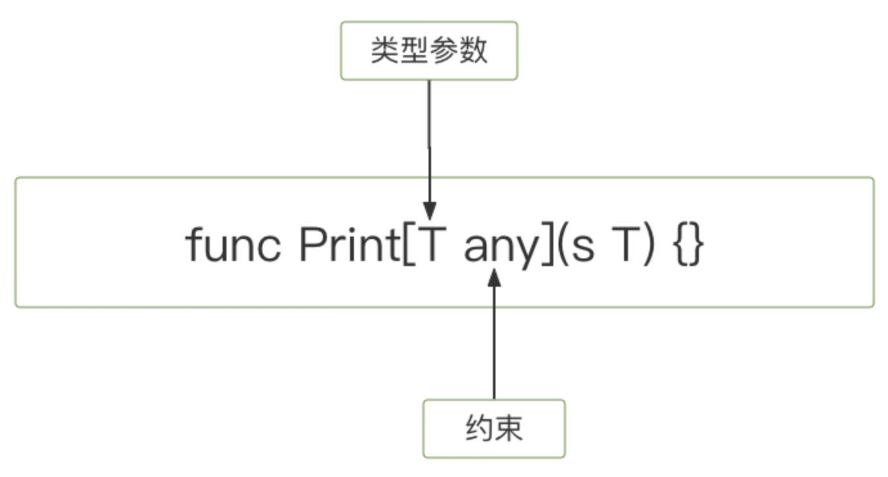
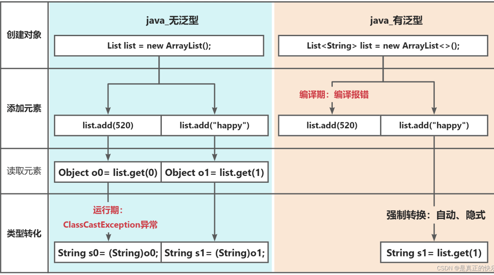
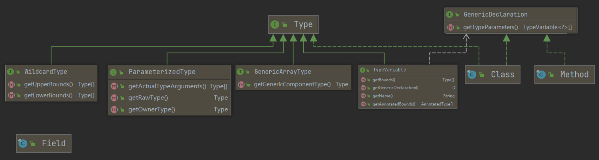

# 基础

## 枚举

### rust

#### 枚举的定义

结构体给予你将字段和数据聚合在一起的方法，像 `Rectangle` 结构体有 `width` 和 `height` 两个字段。而枚举给予你一个途径去声明某个值是一个集合中的一员。比如，我们想让 `Rectangle` 是一些形状的集合，包含 `Circle` 和 `Triangle` 。为了做到这个，Rust 提供了枚举类型。

让我们看看一个需要诉诸于代码的场景，来考虑为何此时使用枚举更为合适且实用。假设我们要处理 IP 地址。目前被广泛使用的两个主要 IP 标准：IPv4（version four）和 IPv6（version six）。这是我们的程序可能会遇到的所有可能的 IP 地址类型：所以可以 **枚举** 出所有可能的值，这也正是此枚举名字的由来。

任何一个 IP 地址要么是 IPv4 的要么是 IPv6 的，而且不能两者都是。IP 地址的这个特性使得枚举数据结构非常适合这个场景，因为枚举值只可能是其中一个成员。IPv4 和 IPv6 从根本上讲仍是 IP 地址，所以当代码在处理适用于任何类型的 IP 地址的场景时应该把它们当作相同的类型。

可以通过在代码中定义一个 `IpAddrKind` 枚举来表现这个概念并列出可能的 IP 地址类型，`V4` 和 `V6`。这被称为枚举的 **成员**（*variants*）：

```rust
enum IpAddrKind {
    V4,
    V6,
}
```

现在 `IpAddrKind` 就是一个可以在代码中使用的自定义数据类型了。

##### 枚举值

可以像这样创建 `IpAddrKind` 两个不同成员的实例：

```rust
    let four = IpAddrKind::V4;
    let six = IpAddrKind::V6;
```

注意枚举的成员位于其标识符的命名空间中，并使用两个冒号分开。这么设计的益处是现在 `IpAddrKind::V4` 和 `IpAddrKind::V6` 都是 `IpAddrKind` 类型的。例如，接着可以定义一个函数来获取任何 `IpAddrKind`：

```rust
fn route(ip_kind: IpAddrKind) {}
```

现在可以使用任一成员来调用这个函数：

```rust
    route(IpAddrKind::V4);
    route(IpAddrKind::V6);
```

使用枚举甚至还有更多优势。进一步考虑一下我们的 IP 地址类型，目前没有一个存储实际 IP 地址 **数据** 的方法；只知道它是什么 **类型** 的。考虑到已经在第五章学习过结构体了，你可能会像示例 6-1 那样处理这个问题：

```rust
    enum IpAddrKind {
        V4,
        V6,
    }

    struct IpAddr {
        kind: IpAddrKind,
        address: String,
    }

    let home = IpAddr {
        kind: IpAddrKind::V4,
        address: String::from("127.0.0.1"),
    };

    let loopback = IpAddr {
        kind: IpAddrKind::V6,
        address: String::from("::1"),
    };
```

示例 6-1：将 IP 地址的数据和 `IpAddrKind` 成员存储在一个 `struct` 中

这里我们定义了一个有两个字段的结构体 `IpAddr`：`IpAddrKind`（之前定义的枚举）类型的 `kind` 字段和 `String` 类型 `address` 字段。我们有这个结构体的两个实例。第一个，`home`，它的 `kind` 的值是 `IpAddrKind::V4` 与之相关联的地址数据是 `127.0.0.1`。第二个实例，`loopback`，`kind` 的值是 `IpAddrKind` 的另一个成员，`V6`，关联的地址是 `::1`。我们使用了一个结构体来将 `kind` 和 `address` 打包在一起，现在枚举成员就与值相关联了。

我们可以使用一种更简洁的方式来表达相同的概念，仅仅使用枚举并将数据直接放进每一个枚举成员而不是将枚举作为结构体的一部分。`IpAddr` 枚举的新定义表明了 `V4` 和 `V6` 成员都关联了 `String` 值：

```rust
    enum IpAddr {
        V4(String),
        V6(String),
    }

    let home = IpAddr::V4(String::from("127.0.0.1"));

    let loopback = IpAddr::V6(String::from("::1"));
```

我们直接将数据附加到枚举的每个成员上，这样就不需要一个额外的结构体了。这里也很容易看出枚举工作的另一个细节：每一个我们定义的枚举成员的名字也变成了一个构建枚举的实例的函数。也就是说，`IpAddr::V4()` 是一个获取 `String` 参数并返回 `IpAddr` 类型实例的函数调用。作为定义枚举的结果，这些构造函数会自动被定义。

用枚举替代结构体还有另一个优势：每个成员可以处理不同类型和数量的数据。IPv4 版本的 IP 地址总是含有四个值在 0 和 255 之间的数字部分。如果我们想要将 `V4` 地址存储为四个 `u8` 值而 `V6` 地址仍然表现为一个 `String`，这就不能使用结构体了。枚举则可以轻易的处理这个情况：

```rust
    enum IpAddr {
        V4(u8, u8, u8, u8),
        V6(String),
    }

    let home = IpAddr::V4(127, 0, 0, 1);

    let loopback = IpAddr::V6(String::from("::1"));
```

这些代码展示了使用枚举来存储两种不同 IP 地址的几种可能的选择。然而，事实证明存储和编码 IP 地址实在是太常见了[以致标准库提供了一个开箱即用的定义！](https://doc.rust-lang.org/std/net/enum.IpAddr.html)让我们看看标准库是如何定义 `IpAddr` 的：它正有着跟我们定义和使用的一样的枚举和成员，不过它将成员中的地址数据嵌入到了两个不同形式的结构体中，它们对不同的成员的定义是不同的：

```rust
struct Ipv4Addr {
    // --snip--
}

struct Ipv6Addr {
    // --snip--
}

enum IpAddr {
    V4(Ipv4Addr),
    V6(Ipv6Addr),
}
```

这些代码展示了可以将任意类型的数据放入枚举成员中：例如字符串、数字类型或者结构体。甚至可以包含另一个枚举！另外，标准库中的类型通常并不比你设想出来的要复杂多少。

注意虽然标准库中包含一个 `IpAddr` 的定义，仍然可以创建和使用我们自己的定义而不会有冲突，因为我们并没有将标准库中的定义引入作用域。第七章会讲到如何导入类型。

来看看示例 6-2 中的另一个枚举的例子：它的成员中内嵌了多种多样的类型：

```rust
enum Message {
    Quit,
    Move { x: i32, y: i32 },
    Write(String),
    ChangeColor(i32, i32, i32),
}
```

示例 6-2：一个 `Message` 枚举，其每个成员都存储了不同数量和类型的值

这个枚举有四个含有不同类型的成员：

- `Quit` 没有关联任何数据。
- `Move` 类似结构体包含命名字段。
- `Write` 包含单独一个 `String`。
- `ChangeColor` 包含三个 `i32`。

定义一个如示例 6-2 中所示那样的有关联值的枚举的方式和定义多个不同类型的结构体的方式很相像，除了枚举不使用 `struct` 关键字以及其所有成员都被组合在一起位于 `Message` 类型下。如下这些结构体可以包含与之前枚举成员中相同的数据：

```rust
struct QuitMessage; // 类单元结构体
struct MoveMessage {
    x: i32,
    y: i32,
}
struct WriteMessage(String); // 元组结构体
struct ChangeColorMessage(i32, i32, i32); // 元组结构体
```

不过，如果我们使用不同的结构体，由于它们都有不同的类型，我们将不能像使用示例 6-2 中定义的 `Message` 枚举那样，轻易的定义一个能够处理这些不同类型的结构体的函数，因为枚举是单独一个类型。

结构体和枚举还有另一个相似点：就像可以使用 `impl` 来为结构体定义方法那样，也可以在枚举上定义方法。这是一个定义于我们 `Message` 枚举上的叫做 `call` 的方法：

```rust
    impl Message {
        fn call(&self) {
            // 在这里定义方法体
        }
    }

    let m = Message::Write(String::from("hello"));
    m.call();
```

方法体使用了 `self` 来获取调用方法的值。这个例子中，创建了一个值为 `Message::Write(String::from("hello"))` 的变量 `m`，而且这就是当 `m.call()` 运行时 `call` 方法中的 `self` 的值。

让我们看看标准库中的另一个非常常见且实用的枚举：`Option`。

##### `Option` 枚举和其相对于空值的优势

这一部分会分析一个 `Option` 的案例，`Option` 是标准库定义的另一个枚举。`Option` 类型应用广泛因为它编码了一个非常普遍的场景，即一个值要么有值要么没值。

例如，如果请求一个非空列表的第一项，会得到一个值，如果请求一个空的列表，就什么也不会得到。从类型系统的角度来表达这个概念就意味着编译器需要检查是否处理了所有应该处理的情况，这样就可以避免在其他编程语言中非常常见的 bug。

编程语言的设计经常要考虑包含哪些功能，但考虑排除哪些功能也很重要。Rust 并没有很多其他语言中有的空值功能。**空值**（*Null* ）是一个值，它代表没有值。在有空值的语言中，变量总是这两种状态之一：空值和非空值。

Tony Hoare，null 的发明者，在他 2009 年的演讲 “Null References: The Billion Dollar Mistake” 中曾经说到：

> I call it my billion-dollar mistake. At that time, I was designing the first comprehensive type system for references in an object-oriented language. My goal was to ensure that all use of references should be absolutely safe, with checking performed automatically by the compiler. But I couldn't resist the temptation to put in a null reference, simply because it was so easy to implement. This has led to innumerable errors, vulnerabilities, and system crashes, which have probably caused a billion dollars of pain and damage in the last forty years.
>
> 我称之为我十亿美元的错误。当时，我在为一个面向对象语言设计第一个综合性的面向引用的类型系统。我的目标是通过编译器的自动检查来保证所有引用的使用都应该是绝对安全的。不过我未能抵抗住引入一个空引用的诱惑，仅仅是因为它是这么的容易实现。这引发了无数错误、漏洞和系统崩溃，在之后的四十多年中造成了数十亿美元的苦痛和伤害。


空值的问题在于当你尝试像一个非空值那样使用一个空值，会出现某种形式的错误。因为空和非空的属性无处不在，非常容易出现这类错误。

然而，空值尝试表达的概念仍然是有意义的：空值是一个因为某种原因目前无效或缺失的值。

问题不在于概念而在于具体的实现。为此，Rust 并没有空值，不过它确实拥有一个可以编码存在或不存在概念的枚举。这个枚举是 `Option<T>`，而且它[定义于标准库中](https://doc.rust-lang.org/std/option/enum.Option.html)，如下：

```rust
enum Option<T> {
    None,
    Some(T),
}
```

`Option<T>` 枚举是如此有用以至于它甚至被包含在了 prelude 之中，你不需要将其显式引入作用域。另外，它的成员也是如此，可以不需要 `Option::` 前缀来直接使用 `Some` 和 `None`。即便如此 `Option<T>` 也仍是常规的枚举，`Some(T)` 和 `None` 仍是 `Option<T>` 的成员。

`<T>` 语法是一个我们还未讲到的 Rust 功能。它是一个泛型类型参数，第十章会更详细的讲解泛型。目前，所有你需要知道的就是 `<T>` 意味着 `Option` 枚举的 `Some` 成员可以包含任意类型的数据，同时每一个用于 `T` 位置的具体类型使得 `Option<T>` 整体作为不同的类型。这里是一些包含数字类型和字符串类型 `Option` 值的例子：

```rust
    let some_number = Some(5);
    let some_char = Some('e');

    let absent_number: Option<i32> = None;
```

`some_number` 的类型是 `Option<i32>`。`some_char` 的类型是 `Option<char>`，这（与 `some_number`）是一个不同的类型。因为我们在 `Some` 成员中指定了值，Rust 可以推断其类型。对于 `absent_number`，Rust 需要我们指定 `Option` 整体的类型，因为编译器只通过 `None` 值无法推断出 `Some` 成员保存的值的类型。这里我们告诉 Rust 希望 `absent_number` 是 `Option<i32>` 类型的。

当有一个 `Some` 值时，我们就知道存在一个值，而这个值保存在 `Some` 中。当有个 `None` 值时，在某种意义上，它跟空值具有相同的意义：并没有一个有效的值。那么，`Option<T>` 为什么就比空值要好呢？

简而言之，因为 `Option<T>` 和 `T`（这里 `T` 可以是任何类型）是不同的类型，编译器不允许像一个肯定有效的值那样使用 `Option<T>`。例如，这段代码不能编译，因为它尝试将 `Option<i8>` 与 `i8` 相加：

```rust
    let x: i8 = 5;
    let y: Option<i8> = Some(5);

    let sum = x + y;
```

如果运行这些代码，将得到类似这样的错误信息：

```console
$ cargo run
   Compiling enums v0.1.0 (file:///projects/enums)
error[E0277]: cannot add `Option<i8>` to `i8`
 --> src/main.rs:5:17
  |
5 |     let sum = x + y;
  |                 ^ no implementation for `i8 + Option<i8>`
  |
  = help: the trait `Add<Option<i8>>` is not implemented for `i8`
  = help: the following other types implement trait `Add<Rhs>`:
            <&'a f32 as Add<f32>>
            <&'a f64 as Add<f64>>
            <&'a i128 as Add<i128>>
            <&'a i16 as Add<i16>>
            <&'a i32 as Add<i32>>
            <&'a i64 as Add<i64>>
            <&'a i8 as Add<i8>>
            <&'a isize as Add<isize>>
          and 48 others

For more information about this error, try `rustc --explain E0277`.
error: could not compile `enums` due to previous error
```

很好！事实上，错误信息意味着 Rust 不知道该如何将 `Option<i8>` 与 `i8` 相加，因为它们的类型不同。当在 Rust 中拥有一个像 `i8` 这样类型的值时，编译器确保它总是有一个有效的值。我们可以自信使用而无需做空值检查。只有当使用 `Option<i8>`（或者任何用到的类型）的时候需要担心可能没有值，而编译器会确保我们在使用值之前处理了为空的情况。

换句话说，在对 `Option<T>` 进行运算之前必须将其转换为 `T`。通常这能帮助我们捕获到空值最常见的问题之一：假设某值不为空但实际上为空的情况。

消除了错误地假设一个非空值的风险，会让你对代码更加有信心。为了拥有一个可能为空的值，你必须要显式的将其放入对应类型的 `Option<T>` 中。接着，当使用这个值时，必须明确的处理值为空的情况。只要一个值不是 `Option<T>` 类型，你就 **可以** 安全的认定它的值不为空。这是 Rust 的一个经过深思熟虑的设计决策，来限制空值的泛滥以增加 Rust 代码的安全性。

那么当有一个 `Option<T>` 的值时，如何从 `Some` 成员中取出 `T` 的值来使用它呢？`Option<T>` 枚举拥有大量用于各种情况的方法：你可以查看[它的文档](https://doc.rust-lang.org/std/option/enum.Option.html)。熟悉 `Option<T>` 的方法将对你的 Rust 之旅非常有用。

总的来说，为了使用 `Option<T>` 值，需要编写处理每个成员的代码。你想要一些代码只当拥有 `Some(T)` 值时运行，允许这些代码使用其中的 `T`。也希望一些代码只在值为 `None` 时运行，这些代码并没有一个可用的 `T` 值。`match` 表达式就是这么一个处理枚举的控制流结构：它会根据枚举的成员运行不同的代码，这些代码可以使用匹配到的值中的数据。

在Rust中，你无法直接将不同类型的值相加，比如将 `i8` 和 `Option<i8>` 相加。为了实现你的目标，你需要考虑如何处理 `Option` 的情况。你可以使用 `match` 表达式或者 `unwrap()` 方法来取出 `Option` 的值，然后再进行相加操作。下面是两种实现方式：


在Rust中，你无法直接将不同类型的值相加，比如将 `i8` 和 `Option<i8>` 相加。为了实现你的目标，你需要考虑如何处理 `Option` 的情况。你可以使用 `match` 表达式或者 `unwrap()` 方法来取出 `Option` 的值，然后再进行相加操作。下面是两种实现方式：

1. 使用 `match` 表达式：

```rust
fn main() {
    let x: i8 = 5;
    let y: Option<i8> = Some(5);

    let sum = match y {
        Some(value) => x + value,
        None => x,
    };

    println!("Sum: {}", sum);
}
```

1. 使用 `unwrap()` 方法：

```rust
fn main() {
    let x: i8 = 5;
    let y: Option<i8> = Some(5);

    let sum = x + y.unwrap_or(0);

    println!("Sum: {}", sum);
}
```

这两种方法都会输出 `Sum: 10`，其中第一种方法使用了 `match` 表达式来处理 `Option` 的可能性，而第二种方法使用了 `unwrap_or()` 方法，如果 `Option` 是 `Some` 类型，则返回其中的值，否则返回指定的默认值，这里是 `0`。

#### match控制流结构

Rust 有一个叫做 `match` 的极为强大的控制流运算符，它允许我们将一个值与一系列的模式相比较，并根据相匹配的模式执行相应代码。

可以把 `match` 表达式想象成某种硬币分类器：硬币滑入有着不同大小孔洞的轨道，每一个硬币都会掉入符合它大小的孔洞。同样地，值也会通过 `match` 的每一个模式，并且在遇到第一个 “符合” 的模式时，值会进入相关联的代码块并在执行中被使用。

因为刚刚提到了硬币，让我们用它们来作为一个使用 `match` 的例子！我们可以编写一个函数来获取一个未知的硬币，并以一种类似验钞机的方式，确定它是何种硬币并返回它的美分值，如示例 6-3 中所示。

```rust
enum Coin {
    Penny,
    Nickel,
    Dime,
    Quarter,
}

fn value_in_cents(coin: Coin) -> u8 {
    match coin {
        Coin::Penny => 1,
        Coin::Nickel => 5,
        Coin::Dime => 10,
        Coin::Quarter => 25,
    }
}
```

示例 6-3：一个枚举和一个以枚举成员作为模式的 `match` 表达式

拆开 `value_in_cents` 函数中的 `match` 来看。首先，我们列出 `match` 关键字后跟一个表达式，在这个例子中是 `coin` 的值。这看起来非常像 `if` 所使用的条件表达式，不过这里有一个非常大的区别：对于 `if`，表达式必须返回一个布尔值，而这里它可以是任何类型的。例子中的 `coin` 的类型是示例 6-3 中定义的 `Coin` 枚举。

接下来是 `match` 的分支。一个分支有两个部分：一个模式和一些代码。第一个分支的模式是值 `Coin::Penny` 而之后的 `=>` 运算符将模式和将要运行的代码分开。这里的代码就仅仅是值 `1`。每一个分支之间使用逗号分隔。

当 `match` 表达式执行时，它将结果值按顺序与每一个分支的模式相比较。如果模式匹配了这个值，这个模式相关联的代码将被执行。如果模式并不匹配这个值，将继续执行下一个分支，非常类似一个硬币分类器。可以拥有任意多的分支：示例 6-3 中的 `match` 有四个分支。

每个分支相关联的代码是一个表达式，而表达式的结果值将作为整个 `match` 表达式的返回值。

如果分支代码较短的话通常不使用大括号，正如示例 6-3 中的每个分支都只是返回一个值。如果想要在分支中运行多行代码，可以使用大括号，而分支后的逗号是可选的。例如，如下代码在每次使用`Coin::Penny` 调用时都会打印出 “Lucky penny!”，同时仍然返回代码块最后的值，`1`：

```rust
fn value_in_cents(coin: Coin) -> u8 {
    match coin {
        Coin::Penny => {
            println!("Lucky penny!");
            1
        }
        Coin::Nickel => 5,
        Coin::Dime => 10,
        Coin::Quarter => 25,
    }
}
```

##### 绑定值的模式

匹配分支的另一个有用的功能是可以绑定匹配的模式的部分值。这也就是如何从枚举成员中提取值的。

作为一个例子，让我们修改枚举的一个成员来存放数据。1999 年到 2008 年间，美国在 25 美分的硬币的一侧为 50 个州的每一个都印刷了不同的设计。其他的硬币都没有这种区分州的设计，所以只有这些 25 美分硬币有特殊的价值。可以将这些信息加入我们的 `enum`，通过改变 `Quarter` 成员来包含一个 `State` 值，示例 6-4 中完成了这些修改：

```rust
#[derive(Debug)] // 这样可以立刻看到州的名称
enum UsState {
    Alabama,
    Alaska,
    // --snip--
}

enum Coin {
    Penny,
    Nickel,
    Dime,
    Quarter(UsState),
}
```

想象一下我们的一个朋友尝试收集所有 50 个州的 25 美分硬币。在根据硬币类型分类零钱的同时，也可以报告出每个 25 美分硬币所对应的州名称，这样如果我们的朋友没有的话，他可以将其加入收藏。

在这些代码的匹配表达式中，我们在匹配 `Coin::Quarter` 成员的分支的模式中增加了一个叫做 `state` 的变量。当匹配到 `Coin::Quarter` 时，变量 `state` 将会绑定 25 美分硬币所对应州的值。接着在那个分支的代码中使用 `state`，如下：

```rust
fn value_in_cents(coin: Coin) -> u8 {
    match coin {
        Coin::Penny => 1,
        Coin::Nickel => 5,
        Coin::Dime => 10,
        Coin::Quarter(state) => {
            println!("State quarter from {:?}!", state);
            25
        }
    }
}
```

如果调用 `value_in_cents(Coin::Quarter(UsState::Alaska))`，`coin` 将是 `Coin::Quarter(UsState::Alaska)`。当将值与每个分支相比较时，没有分支会匹配，直到遇到 `Coin::Quarter(state)`。这时，`state` 绑定的将会是值 `UsState::Alaska`。接着就可以在 `println!` 表达式中使用这个绑定了，像这样就可以获取 `Coin` 枚举的 `Quarter` 成员中内部的州的值。

##### 匹配 `Option`

我们在之前的部分中使用 `Option<T>` 时，是为了从 `Some` 中取出其内部的 `T` 值；我们还可以像处理 `Coin` 枚举那样使用 `match` 处理 `Option<T>`！只不过这回比较的不再是硬币，而是 `Option<T>` 的成员，但 `match` 表达式的工作方式保持不变。

比如我们想要编写一个函数，它获取一个 `Option<i32>` ，如果其中含有一个值，将其加一。如果其中没有值，函数应该返回 `None` 值，而不尝试执行任何操作。

得益于 `match`，编写这个函数非常简单，它将看起来像示例 6-5 中这样：

```rust
    fn plus_one(x: Option<i32>) -> Option<i32> {
        match x {
            None => None,
            Some(i) => Some(i + 1),
        }
    }

    let five = Some(5);
    let six = plus_one(five);
    let none = plus_one(None);
```

让我们更仔细地检查 `plus_one` 的第一行操作。当调用 `plus_one(five)` 时，`plus_one` 函数体中的 `x` 将会是值 `Some(5)`。接着将其与每个分支比较。

```rust
            None => None,
```

值 `Some(5)` 并不匹配模式 `None`，所以继续进行下一个分支。

```rust
            Some(i) => Some(i + 1),
```

`Some(5)` 与 `Some(i)` 匹配吗？当然匹配！它们是相同的成员。`i` 绑定了 `Some` 中包含的值，所以 `i` 的值是 `5`。接着匹配分支的代码被执行，所以我们将 `i` 的值加一并返回一个含有值 `6` 的新 `Some`。

接着考虑下示例 6-5 中 `plus_one` 的第二个调用，这里 `x` 是 `None`。我们进入 `match` 并与第一个分支相比较。

```rust
            None => None,
```

匹配上了！这里没有值来加一，所以程序结束并返回 `=>` 右侧的值 `None`，因为第一个分支就匹配到了，其他的分支将不再比较。

将 `match` 与枚举相结合在很多场景中都是有用的。你会在 Rust 代码中看到很多这样的模式：`match` 一个枚举，绑定其中的值到一个变量，接着根据其值执行代码。这在一开始有点复杂，不过一旦习惯了，你会希望所有语言都拥有它！这一直是用户的最爱。

`match` 还有另一方面需要讨论：这些分支必须覆盖了所有的可能性。考虑一下 `plus_one` 函数的这个版本，它有一个 bug 并不能编译：

```rust
    fn plus_one(x: Option<i32>) -> Option<i32> {
        match x {
            Some(i) => Some(i + 1),
        }
    }
```

我们没有处理 `None` 的情况，所以这些代码会造成一个 bug。幸运的是，这是一个 Rust 知道如何处理的 bug。如果尝试编译这段代码，会得到这个错误：

```console
$ cargo run
   Compiling enums v0.1.0 (file:///projects/enums)
error[E0004]: non-exhaustive patterns: `None` not covered
 --> src/main.rs:3:15
  |
3 |         match x {
  |               ^ pattern `None` not covered
  |
note: `Option<i32>` defined here
  = note: the matched value is of type `Option<i32>`
help: ensure that all possible cases are being handled by adding a match arm with a wildcard pattern or an explicit pattern as shown
  |
4 ~             Some(i) => Some(i + 1),
5 ~             None => todo!(),
  |

For more information about this error, try `rustc --explain E0004`.
error: could not compile `enums` due to previous error
```

Rust 知道我们没有覆盖所有可能的情况甚至知道哪些模式被忘记了！Rust 中的匹配是 **穷尽的**（*exhaustive*）：必须穷举到最后的可能性来使代码有效。特别的在这个 `Option<T>` 的例子中，Rust 防止我们忘记明确的处理 `None` 的情况，这让我们免于假设拥有一个实际上为空的值，从而使之前提到的价值亿万的错误不可能发生。

让我们看一个例子，我们希望对一些特定的值采取特殊操作，而对其他的值采取默认操作。想象我们正在玩一个游戏，如果你掷出骰子的值为 3，角色不会移动，而是会得到一顶新奇的帽子。如果你掷出了 7，你的角色将失去新奇的帽子。对于其他的数值，你的角色会在棋盘上移动相应的格子。这是一个实现了上述逻辑的 `match`，骰子的结果是硬编码而不是一个随机值，其他的逻辑部分使用了没有函数体的函数来表示，实现它们超出了本例的范围：

```rust
    let dice_roll = 9;
    match dice_roll {
        3 => add_fancy_hat(),
        7 => remove_fancy_hat(),
        other => move_player(other),
    }

    fn add_fancy_hat() {}
    fn remove_fancy_hat() {}
    fn move_player(num_spaces: u8) {}
```

对于前两个分支，匹配模式是字面值 `3` 和 `7`，最后一个分支则涵盖了所有其他可能的值，模式是我们命名为 `other` 的一个变量。`other` 分支的代码通过将其传递给 `move_player` 函数来使用这个变量。

即使我们没有列出 `u8` 所有可能的值，这段代码依然能够编译，因为最后一个模式将匹配所有未被特殊列出的值。这种通配模式满足了 `match` 必须被穷尽的要求。请注意，我们必须将通配分支放在最后，因为模式是按顺序匹配的。如果我们在通配分支后添加其他分支，Rust 将会警告我们，因为此后的分支永远不会被匹配到。

Rust 还提供了一个模式，当我们不想使用通配模式获取的值时，请使用 `_` ，这是一个特殊的模式，可以匹配任意值而不绑定到该值。这告诉 Rust 我们不会使用这个值，所以 Rust 也不会警告我们存在未使用的变量。

让我们改变游戏规则：现在，当你掷出的值不是 3 或 7 的时候，你必须再次掷出。这种情况下我们不需要使用这个值，所以我们改动代码使用 `_` 来替代变量 `other` ：

```rust
    let dice_roll = 9;
    match dice_roll {
        3 => add_fancy_hat(),
        7 => remove_fancy_hat(),
        _ => reroll(),
    }

    fn add_fancy_hat() {}
    fn remove_fancy_hat() {}
    fn reroll() {}
```


这个例子也满足穷举性要求，因为我们在最后一个分支中明确地忽略了其他的值。我们没有忘记处理任何东西。

最后，让我们再次改变游戏规则，如果你掷出 3 或 7 以外的值，你的回合将无事发生。我们可以使用单元值（在[“元组类型”](https://kaisery.github.io/trpl-zh-cn/ch03-02-data-types.html#元组类型)一节中提到的空元组）作为 `_` 分支的代码：

```rust
    let dice_roll = 9;
    match dice_roll {
        3 => add_fancy_hat(),
        7 => remove_fancy_hat(),
        _ => (),
    }

    fn add_fancy_hat() {}
    fn remove_fancy_hat() {}
```


#### if let简洁控制流

`if let` 语法让我们以一种不那么冗长的方式结合 `if` 和 `let`，来处理只匹配一个模式的值而忽略其他模式的情况。考虑示例 6-6 中的程序，它匹配一个 `config_max` 变量中的 `Option<u8>` 值并只希望当值为 `Some` 成员时执行代码：

```rust
    let config_max = Some(3u8);
    match config_max {
        Some(max) => println!("The maximum is configured to be {}", max),
        _ => (),
    }
```

示例 6-6：`match` 只关心当值为 `Some` 时执行代码

如果值是 `Some`，我们希望打印出 `Some` 成员中的值，这个值被绑定到模式中的 `max` 变量里。对于 `None` 值我们不希望做任何操作。为了满足 `match` 表达式（穷尽性）的要求，必须在处理完这唯一的成员后加上 `_ => ()`，这样也要增加很多烦人的样板代码。

不过我们可以使用 `if let` 这种更短的方式编写。如下代码与示例 6-6 中的 `match` 行为一致：

```rust
    let config_max = Some(3u8);
    if let Some(max) = config_max {
        println!("The maximum is configured to be {}", max);
    }
```

`if let` 语法获取通过等号分隔的一个模式和一个表达式。它的工作方式与 `match` 相同，这里的表达式对应 `match` 而模式则对应第一个分支。在这个例子中，模式是 `Some(max)`，`max` 绑定为 `Some` 中的值。接着可以在 `if let` 代码块中使用 `max` 了，就跟在对应的 `match` 分支中一样。模式不匹配时 `if let` 块中的代码不会执行。

使用 `if let` 意味着编写更少代码，更少的缩进和更少的样板代码。然而，这样会失去 `match` 强制要求的穷尽性检查。`match` 和 `if let` 之间的选择依赖特定的环境以及增加简洁度和失去穷尽性检查的权衡取舍。

换句话说，可以认为 `if let` 是 `match` 的一个语法糖，它当值匹配某一模式时执行代码而忽略所有其他值。

可以在 `if let` 中包含一个 `else`。`else` 块中的代码与 `match` 表达式中的 `_` 分支块中的代码相同，这样的 `match` 表达式就等同于 `if let` 和 `else`。回忆一下示例 6-4 中 `Coin` 枚举的定义，其 `Quarter` 成员也包含一个 `UsState` 值。如果想要计数所有不是 25 美分的硬币的同时也报告 25 美分硬币所属的州，可以使用这样一个 `match` 表达式：

```rust
    let mut count = 0;
    match coin {
        Coin::Quarter(state) => println!("State quarter from {:?}!", state),
        _ => count += 1,
    }
```

或者可以使用这样的 `if let` 和 `else` 表达式：

```rust
    let mut count = 0;
    if let Coin::Quarter(state) = coin {
        println!("State quarter from {:?}!", state);
    } else {
        count += 1;
    }
```

如果你的程序遇到一个使用 `match` 表达起来过于啰嗦的逻辑，记住 `if let` 也在你的 Rust 工具箱中。


### go

go语言不像其他高级语言（如Java），没有内置枚举类型。**那go语言中如何玩枚举呢？**

#### 使用const定义枚举

**枚举本质就是一系列常量**。所以，go语言中可以使用`const`来定义枚举，如：

```go
const (
   Male   = "男性"
   Female = "女性"
)
```

#### 最佳实践

1. 可以使用**类型别名**，让常量看起来**更直观**：根据类型就能明确知道该常量是啥枚举。比如：

```ini
type Gender = string

const (
   Male   Gender = "男性"
   Female Gender = "女性"
)
```

通过类型别名可以很直观、很明确地知道`Male`和`Female`两个常量是性别枚举。

1. 如果这个枚举有**自定义方法**，可以使用`type`关键字新建枚举类型，然后为该枚举类型定义方法。如:

```go
type Gender string

const (
   Male   Gender = "男性"
   Female Gender = "女性"
)

func (g *Gender) String() string {
   switch *g {
   case Male:
      return "男性"
   case Female:
      return "女性"
   default:
      return ""
   }
}
```

比如，看看`google.golang.org/grpc/codes`里的gRPC的**错误码**是怎么定义的:

```go
const (
   OK                 Code = 0
   Canceled           Code = 1
   Unknown            Code = 2
   InvalidArgument    Code = 3
   DeadlineExceeded   Code = 4
   AlreadyExists      Code = 6
   PermissionDenied   Code = 7
   ResourceExhausted  Code = 8
   FailedPrecondition Code = 9
   Aborted            Code = 10
   OutOfRange         Code = 11
   Unimplemented      Code = 12
   Internal           Code = 13
   Unavailable        Code = 14
   DataLoss           Code = 15
   Unauthenticated    Code = 16
   _maxCode                = 17
)

func (c Code) String() string {
   switch c {
   case OK:
      return "OK"
   case Canceled:
      return "Canceled"
   case Unknown:
      return "Unknown"
   case InvalidArgument:
      return "InvalidArgument"
   case DeadlineExceeded:
      return "DeadlineExceeded"
   case NotFound:
      return "NotFound"
   case AlreadyExists:
      return "AlreadyExists"
   case PermissionDenied:
      return "PermissionDenied"
   case ResourceExhausted:
      return "ResourceExhausted"
   case FailedPrecondition:
      return "FailedPrecondition"
   case Aborted:
      return "Aborted"
   case OutOfRange:
      return "OutOfRange"
   case Unimplemented:
      return "Unimplemented"
   case Internal:
      return "Internal"
   case Unavailable:
      return "Unavailable"
   case DataLoss:
      return "DataLoss"
   case Unauthenticated:
      return "Unauthenticated"
   default:
      return "Code(" + strconv.FormatInt(int64(c), 10) + ")"
   }
}

```


在Java中，每个枚举有一个类，如性别枚举`Gender`类，可以直接`Gender.XXX`就能很方便地访问性别枚举了，也能很清晰地知道有哪些枚举值。
而在go里面就**没有这么方便了**，也不太好管理枚举。


### Java

JDK1.5引入了新的类型——枚举。在 Java 中它虽然算个“小”功能，却给我的开发带来了“大”方便。

#### 用法一：常量
在JDK1.5 之前，我们定义常量都是： public static final.... 。现在好了，有了枚举，可以把相关的常量分组到一个枚举类型里，而且枚举提供了比常量更多的方法。 

```java
public enum Color {  
  RED, GREEN, BLANK, YELLOW  
} 
```

#### 用法二：switch

JDK1.6之前的switch语句只支持int,char,[enum](https://so.csdn.net/so/search?q=enum&spm=1001.2101.3001.7020)类型，使用枚举，能让我们的代码可读性更强。

```java
enum Signal {  
    GREEN, YELLOW, RED  
}  
public class TrafficLight {  
    Signal color = Signal.RED;  
    public void change() {  
        switch (color) {  
        case RED:  
            color = Signal.GREEN;  
            break;  
        case YELLOW:  
            color = Signal.RED;  
            break;  
        case GREEN:  
            color = Signal.YELLOW;  
            break;  
        }  
    }  
}  
```

#### 用法三：向枚举中添加新方法

如果打算自定义自己的方法，那么必须在enum实例序列的最后添加一个分号。

而且 Java 要求必须先定义 enum 实例。 

```java
public enum Color {  
    RED("红色", 1), GREEN("绿色", 2), BLANK("白色", 3), YELLO("黄色", 4);  
    // 成员变量  
    private String name;  
    private int index;  
    // 构造方法  
    private Color(String name, int index) {  
        this.name = name;  
        this.index = index;  
    }  
    // 普通方法  
    public static String getName(int index) {  
        for (Color c : Color.values()) {  
            if (c.getIndex() == index) {  
                return c.name;  
            }  
        }  
        return null;  
    }  
    // get set 方法  
    public String getName() {  
        return name;  
    }  
    public void setName(String name) {  
        this.name = name;  
    }  
    public int getIndex() {  
        return index;  
    }  
    public void setIndex(int index) {  
        this.index = index;  
    }  
}  
```

#### 用法四：覆盖枚举的方法

下面给出一个toString()方法覆盖的例子。 

```java
public enum Color {  
    RED("红色", 1), GREEN("绿色", 2), BLANK("白色", 3), YELLO("黄色", 4);  
    // 成员变量  
    private String name;  
    private int index;  
    // 构造方法  
    private Color(String name, int index) {  
        this.name = name;  
        this.index = index;  
    }  
    //覆盖方法  
    @Override  
    public String toString() {  
        return this.index+"_"+this.name;  
    }  
}  
```

####  用法五：实现接口

所有的枚举都继承自java.lang.Enum类。由于Java 不支持多继承，所以枚举对象不能再继承其他类。 

```java
public interface Behaviour {  
    void print();  
    String getInfo();  
}  
public enum Color implements Behaviour{  
    RED("红色", 1), GREEN("绿色", 2), BLANK("白色", 3), YELLO("黄色", 4);  
    // 成员变量  
    private String name;  
    private int index;  
    // 构造方法  
    private Color(String name, int index) {  
        this.name = name;  
        this.index = index;  
    }  
//接口方法  
    @Override  
    public String getInfo() {  
        return this.name;  
    }  
    //接口方法  
    @Override  
    public void print() {  
        System.out.println(this.index+":"+this.name);  
    }  
}  
```

#### 用法六：使用接口组织枚举

```java
public interface Food {  
    enum Coffee implements Food{  
        BLACK_COFFEE,DECAF_COFFEE,LATTE,CAPPUCCINO  
    }  
    enum Dessert implements Food{  
        FRUIT, CAKE, GELATO  
    }  
}  
```

#### 用法七：关于枚举集合的使用
java.util.EnumSet和java.util.EnumMap是两个枚举集合。EnumSet保证集合中的元素不重复；EnumMap中的 key是enum类型，而value则可以是任意类型。关于这个两个集合的使用就不在这里赘述，可以参考JDK文档。


## 泛型

### rust

所有的编程语言都致力于将重复的任务简单化，并为此提供各种各样的工具。在 Rust 中，泛型（generics）就是这样一种工具，本文就来聊聊Rust中泛型的使用，需要的可以参考一下

所有的编程语言都致力于将重复的任务简单化，并为此提供各种各样的工具。在 Rust 中，泛型（generics）就是这样一种工具，它是具体类型或其它属性的抽象替代。在编写代码时，我们可以直接描述泛型的行为，以及与其它泛型产生的联系，而无须知晓它在编译和运行代码时采用的具体类型。

总结一下泛型就是，提高代码的复用能力，处理重复代码。泛型是具体类型或者其它属性的抽象代替，编写的泛型代码不是最终的代码，而是一些模板，里面有一些占位符，编译器在编译的时候会将占位符替换为具体的类型。

#### 函数中的泛型

函数中定义泛型的时候，我们需要将泛型定义在函数的签名中：

```rust
// 这种定义方式是错误的，因为 T 不在作用域中``
// 我们要将其放在签名里面``
fn func(arg: T) -> T {arg }
// 这样做是正确的``
fn func<T>(arg: T) -> T {arg}
```

里面的 T 就是一个泛型，它可以代表任意的类型，然后在编译的时候会将其替换成具体的类型，这个过程叫做单态化。

另外这个 T 就是一个占位符，你换成别的也可以，只是我们一般写作 T。

```rust
fn func<T>(arg: T) -> T {
    arg
}

fn main() {
    let x = func(30);
    println!("x is {:?}", x);
    let x = func("i am jason");
    println!("x is {:?}", x);
    let x = func(String::from("I love rust"));
    println!("x is {:?}", x);
    let x = func(vec![1, 2, 3, 4]);
    println!("x is {:?}", x);
}
```

这里我们连续声明了多个变量 x，这在 Rust 里面是没有问题的，因为 Rust 有一个变量隐藏机制。然后再来看一下变量 x 的类型，虽然泛型 T 可以代表任意类型，但 Rust 在编译的时候会执行单态化，确定泛型的具体类型。

比如传一个 123，那么 T 就会被标记为 i32，因此返回的也是 i32，至于其它类型同理。还是那句话，T 只是一个占位符，至于它到底代表什么类型，取决于我们调用时传递的值是什么类型。

比如传递一个 &str，那么函数就会被 Rust 替换成如下：

```rust
fn func(arg: &str) -> &str {
    arg
}
```

以上过程被称为单态化，Rust 在编译期间会将泛型 T 替换成具体的类型。因此如果想使用泛型，那么函数签名中的泛型一定要出现在函数参数中，然后根据调用方传递的值的类型，来确定泛型。

总结一下：泛型一定要在函数的签名中，也就是在函数后面通过 <> 进行指定，否则的话泛型是无法使用的。此外，泛型还要出现在参数中，这是毫无疑问的，不然定义泛型干啥。

当然啦，泛型不止可以定义一个，定义任意个都是可以的。

```rust
// 如果有多个泛型，那么在 <> 里面通过逗号分隔
// 然后要保证函数签名 <> 里面声明的泛型，
// 都要在函数参数中出现，也就是要将定义的泛型全用上
fn func<A, B, C>(
    arg1: A, arg2: B, arg3: C
) -> (C, A) {
    (arg3, arg1)
}
 
fn main() {
    // 函数 func 定义了三个泛型，然后返回的类型是 (C, A)
    // 这里传递三个参数，显然当调用时，Rust 会确定泛型代表的类型
    // A 是 i32，B 是 f64，C 是 &str
    let x = func(123, 3.14, "你好");
 
    // 泛型可以接收任何类型，那么当调用时
    // A 是 Vec<i32>，B 是 [i32;2]，C 是 (i32, i32)
    let y = func(vec![1, 2], [1, 2], (3, 4));
}
```

这里我们定义了三个泛型，然后返回的类型是 (C, A)。而 Rust 会根据参数的类型，来确定泛型，所以变量 x 是 (&str, i32) 类型，变量 y 是 ((i32, i32), Vec<i32>) 类型。

事实上 IDE 也已经推断出来了，总的来说泛型应该不难理解。

#### 结构体中的泛型

如果一个结构体成员的类型不确定，那么也可以定义为泛型。

```rust
struct Point<T> {
    x: T,
    y: T
}
```

和函数一样，泛型一定要写在 <> 当中作为签名出现，然后才可以使用，相当于告诉 Rust 都定义了哪些泛型。然后签名中的泛型，一定要全部使用，会根据函数调用时给参数传的值、或者实例化结构体时给成员传的值，来确定泛型代表哪一种类型。

如果签名中的泛型没有全部使用，那么 Rust 就无法执行单态化，于是报错。所以泛型一定要全部使用，再说了，不使用的话，定义它干嘛。

```rust
struct Point<T> {
    x: T,
    y: T
}
 
fn main() {
    let p1 = Point{x: 11, y: 22};
    let p2 = Point{x: 11.1, y: 22.2};
}
```

T 只是一个占位符，具体什么类型要由我们传递的内容决定，可以是 i32，可以是 f64。但由于成员 x 和 y 的类型都是 T，所以它们的类型一定是一样的，要是 i32 则都是 i32，要是 f64 则都是 f64。

如果希望类型不同，那么只需要两个泛型即可。

```rust
struct Point<T, U> {
    x: T,
    y: U
}
 
fn main() {
    // x 和 y 的类型可以相同，也可以不同
    // 因为它们都可以接收任意类型
    let p1 = Point{x: 11, y: 22};
    let p2 = Point{x: 11.1, y: 22.2};
    let p3 = Point{x: "11.1", y: String::from("satori")};
    let p3 = Point{x: vec![1, 2, 3], y: (1, 2, 3)};
}
```

还是那句话，泛型可以接收任意类型，想传啥都行，具体根据我们传递的值来确定。

#### 枚举中的泛型

枚举也是支持泛型的，比如之前使用的 Option<T> 就是一种泛型，它的结构如下：

```rust
enum Option<T> {
    Some(T),
    None
}
```

里面的 T 可以代表任意类型，然后我们再来自定义一个枚举。

```rust
// 签名中的泛型参数必须都要使用
// 比如函数签名的泛型，要全部体现在参数中
// 枚举和结构体签名的泛型，要全部体现在成员中
enum MyOption<A, B, C> {
    // 这里 A、B、C 都是我们随便定义的，可以代指任意类型
    // 具体是哪种类型，则看我们传递了什么
    Some1(A),
    Some2(B),
    Some3(C),
}
 
fn main() {
    // 泛型不影响效率，是因为 Rust 要进行单态化
    // 所以泛型究竟代表哪一种类型要提前确定好
    // 这里必须要显式指定 x 的类型。枚举和结构体不同
    // 结构体每个成员都要赋值，所以 Rust 能够基于赋的值推断出所有的泛型
    // 但枚举的话，每次只会用到里面的一个成员
    // 如果还有其它泛型，那么 Rust 就无法推断了
    // 比如这里只能推断出泛型 C 代表的类型，而 A 和 B 就无法推断了
    // 因此每个泛型代表什么类型，需要我们手动指定好
     let x: MyOption<i32, f64, u8> = MyOption::Some1(123);
    match x {
        MyOption::Some1(value) => println!("我是i32：{}", value),
        MyOption::Some2(value) => println!("我是f64：{}", value),
        MyOption::Some3(value) => println!("我是u8：{}", value),
    }
 
    // 泛型可以代表任意类型，指定啥都是可以的
     let y: MyOption<u8, i32, String> = MyOption::Some3(String::from("xxx"));
    match y {
        MyOption::Some1(v) => println!("我是 u8:{}", v),
        MyOption::Some2(v) => println!("我是 i32 : {}", v),
        MyOption::Some3(v) => println!("我是 String : {}", v),
    }
    let z: MyOption<u8, i32, String> = MyOption::Some2(34);
    match z {
        MyOption::Some1(v) => println!("我是 u8 {}", v),
        MyOption::Some2(v) => println!("我是 i32 {}", v),
        MyOption::Some3(v) => println!("我是 String {}", v),
    }
     
    /*
    我是 u8
    我是 String
    */
}
```

如果觉得上面的例子不好理解的话，那么再举个简单的例子：

```rust
enum MyOption<T> {
    MySome1(T),
    MySome2(i32),
    MySome3(T),
    MyNone
}
 
fn main() {
    // 这里我们没有指定 x 的类型
    // 这是因为 MyOption 只有一个泛型
    // 通过给 MySome1 传递的值，可以推断出 T 的类型
    let x = MyOption::MySome1(123);
 
    // 同样的道理，Rust 可以自动推断，得出 T 是 &str
    let x = MyOption::MySome3("123");
 
    // 但此处就无法自动推断了，因为赋值的是 MySome2 成员
    // 此时 Rust 获取不到任何有关 T 的信息，无法执行推断
    // 因此我们需要手动指定类型，但仔细观察一下声明
    // 首先，如果没有泛型的话，那么直接 let x: MyOption = ... 即可
    // 但里面有泛型，所以此时除了类型之外，还要连同泛型一起指定
    // 也就是 MyOption<f64>
    let x: MyOption<f64> = MyOption::MySome2(123);
 
    // 当然泛型可以代表任意类型，此时的 T 则是一个 Vec<i32> 类型
    let x: MyOption<Vec<i32>> = MyOption::MySome2(123);
}
```

所以一定要注意：在声明变量的时候，如果 Rust 不能根据我们赋的值推断出泛型代表的类型，那么我们必须要手动声明类型，来告诉 Rust 泛型的相关信息，这样才可以执行单态化。

对于结构体也是同样的道理：

```rust
struct Girl1 {
    field: i32,
}
 
struct Girl2<T> {
    field: T,
}
 
fn main() {
    // 下面两个语句类似，只是第二次声明 g1 的时候多指定了类型
    let g1 = Girl1 { field: 123 };
    let g1: Girl1 = Girl1 { field: 123 };
 
    // 下面两条语句也是类似的，第二次声明 g2 的时候多指定了类型
    // 但此时的类型有些不一样，Girl2 的结尾多了一个 <i32>
    // 原因很简单，因为 Girl2 里面有泛型
    // 所以在显式指定类型的时候，还要将泛型代表的类型一块指定，否则报错
    let g2 = Girl2 { field: 123 };
    let g2: Girl2<i32> = Girl2 { field: 123 };
}
```

然后还有一点比较重要，就是在声明的时候，只需在 **<>** 里面指定泛型即可，什么意思呢？举个例子：

```rust
struct Girl<E, T, W> {
    field1: String,
    field2: T,
    field3: W,
    field4: E,
    field5: i32,
}
 
fn main() {
    // 这里可以不指定类型，因为 Rust 可以推断出来
    // 不过这里我们就显式指定。而虽然 Girl 有 5 个成员
    // 但泛型的数量是三个，因此声明变量的时候也要指定三个
    // 由于定义结构体的时候，泛型顺序是 E T W
    // 所以这里的 f64 就是 E，u8 就是 T，Vec<i32> 就是 W
    let g: Girl<f64, u8, Vec<i32>> = Girl {
        field1: String::from("hello"),
        field2: 123u8,
        field3: vec![1, 2, 3],
        field4: 3.14,
        field5: 666,
    };
}
```

以上就是在枚举中使用泛型，并且针对泛型的用法稍微多啰嗦了一些。

#### 方法中的泛型

我们也可以对方法实现泛型，举个例子：

```rust
struct Point<T, U> {
    x: T,
    y: U
}
 
// 针对 i32、f64 实现的方法
// 只有传递的 T、U 对应 i32、f64 才可以调用
impl Point<i32, f64> {
    fn m1(&self) {
        println!("我是 m1 方法")
    }
}
 
fn main() {
    let p1 = Point{x: 123, y: 3.14};
    p1.m1();  // 我是 m1 方法
 
    let p2 = Point{x: 3.14, y: 123};
    //p2.m1();
    //调用失败，因为 T 和 U 不是 i32、f64，而是 f64、i32
    //所以 p2 无法调用 m1 方法
}
```

可能有人好奇了，声明方法的时候不考虑泛型可不可以，也就是 impl Point {}。答案是不可以，如果结构体中有泛型，那么声明方法的时候必须指定。但这就产生了一个问题，那就是只有指定类型的结构体才能调用方法。

比如上述代码，只有当 x 和 y 分别为 i32、f64 时，才可以调用方法，如果我希望所有的结构体实例都可以调用呢？

```rust
struct Point<T, U> {
    x: T,
    y: U
}
 
// 针对 K、f64 实现的方法，由于 K 是一个泛型
// 所以它可以代表任何类型（泛型只是一个符号）
// 因此不管 T 最终是什么类型，i32 也好、&str 也罢
// K 都可以接收，只要 U 是 f64 即可
// 然后注意：如果声明方法时结构体后面指定了泛型
// 那么必须将使用的泛型在 impl 后面声明
impl <K> Point<K, f64> {
    fn m1(&self) {
        println!("我是 m1 方法")
    }
}
 
// 此时 K 和 S 都是泛型，那么此时对结构体就没有要求了
// 因为不管 T 和 W 代表什么，K 和 S 都能表示，因为它们都是泛型
impl <K, S> Point<K, S> {
    fn m2(&self) {
        println!("我是 m2 方法")
    }
}
 
// 这里我们没有使用泛型，所以也就无需在 impl 后面声明
// 但很明显，此时结构体实例如果想调用 m3 方法
// 那么必须满足 T 是 u8，W 是 f64
impl Point<u8, f64> {
    fn m3(&self) {
        println!("我是 m3 方法")
    }
}
 
fn main() {
    // 显然 p1 可以同时调用 m1 和 m2 方法，但 m3 不行
    // 因为 m3 要求 T 是一个 u8，而当前是 &str
    let p1 = Point{x: "hello", y: 3.14};
    p1.m1();  // 我是 m1 方法
    p1.m2();  // 我是 m2 方法
 
    // 显然 p2 可以同时调用 m1、m2、m3
    // 另外这里的 x 可以直接写成 123，无需在结尾加上 u8
    // 因为 Rust 看到我们调用了 m3 方法，会自动推断为 u8
    let p2 = Point{x: 123u8, y: 3.14};
    p2.m1();  // 我是 m1 方法
    p2.m2();  // 我是 m2 方法
    p2.m3();  // 我是 m3 方法
 
    // 显然 p3 只能调用 m2 方法，因为 m2 对 T 和 W 没有要求
    // 但是像 m3 就不能调用，因为它是为 <u8, f64> 实现的方法
    // 只有当 T、W 为 u8、f64 时才可以调用
    // 显然此时是不满足的，因为都是 &str，至于 m1 方法也是同理
    // 所以 p3 只能调用 m2，这个方法是为 <K, S> 实现的
    // 而 K 和 S 也是泛型，可以代表任意类型，因此没问题
    let p3 = Point{x: "3.14", y: "123"};
    p3.m2();  // 我是 m2 方法
}
```

然后注意：我们上面的泛型本质上针对的还是结构体，而我们定义方法的时候也可以指定泛型，其语法和在函数中定义泛型是一样的。

```rust
#[derive(Debug)]
struct Point<T, U> {
    x: T,
    y: U,
}
 
// 使用 impl 时 Point 后面的泛型名称可以任意
// 比如我们之前起名为 K 和 S，但这样容易乱，因为字母太多了
// 所以建议：使用 impl 时的泛型和定义结构体时的泛型保持一致即可
impl<T, U> Point<T, U> {
    // 方法类似于函数，它是一个独立的个体，可以有自己独立的泛型
    // 然后返回值，因为 Point 里面是泛型，可以代表任意类型
    // 那么自然也可以是其它的泛型
    fn m1<V, W>(self, a: V, b: W) -> Point<U, W> {
        // 所以返回值的成员 x 的类型是 U，那么它应该来自于 self.y
        // 成员 y 的类型是 W，它来自于参数 b
        Point { x: self.y, y: b }
    }
}
 
fn main() {
    // T 是 i32，U 是 f64
    let p1 = Point { x: 123, y: 3.14 };
    // V 是 &str，W 是 (i32, i32, i32)
    println!("{:?}", p1.m1("xx", (1, 2, 3)))
    // Point { x: 3.14, y: (1, 2, 3) }
}
```

以上就是 Rust 的泛型，当然在工作中我们不会声明的这么复杂，这里只是为了更好掌握泛型的语法。

然后注意一下方法里面的 self，不是说方法的第一个参数应该是引用吗？理论上是这样的，但此处不行，而且如果写成 &self 是会报错的，会告诉我们没有实现 Copy 这个 trait。

之所以会有这个现象，是因为我们在返回值当中将 self.y 赋值给了成员 x。那么问题来了，如果方法的第一个参数是引用，就意味着结构体在调用完方法之后还能继续用，那么结构体内部所有成员的值都必须有效，否则结构体就没法用了。这个动态数组相似，如果动态数组是有效的，那么内部的所有元素必须都是有效的，否则就可能访问非法的内存。

因此在构建返回值、将 self.y 赋值给成员 x 的时候，就必须将 self.y 拷贝一份，并且还要满足拷贝完之后数据是各自独立的，互不影响。如果 self.y 的数据全部在栈上（可 Copy 的），那么这是没问题的；如果涉及到堆，那么只能转移 self.y 的所有权，因为 Rust 默认不会拷贝堆数据，但如果转移所有权，那么方法调用完之后结构体就不能用了，这与我们将第一个参数声明为引用的目的相矛盾。

所以 Rust 要求 self.y 必须是可 Copy 的，也就是数据必须都在栈上，这样才能满足在不拷贝堆数据的前提下，让 self.y 赋值之后依旧保持有效。但问题是，self.y 的类型是 U，而 U 代表啥类型 Rust 又不知道，所以 Rust 认为 U 不是可 Copy 的，或者说没有实现 Copy 这个 trait，于是报错。

因此第一个参数必须声明为 self，此时泛型是否实现 Copy 就不重要了，没实现的话会直接转移所有权。因为该结构体实例在调用完方法之后会被销毁，不再被使用，那么此时可以转移内部成员的所有权。正所谓人都没了，还要这所有权有啥用，不如在销毁之前将成员值的所有权交给别人。

**最后说一下泛型代码的性能，使用泛型的代码和使用具体类型的速度是一样的，因此这就要求 Rust 在编译的时候能够推断出泛型的具体类型，所以类型要明确。**

#### 泛型生命周期

为了在函数签名中使用生命周期注解，需要在函数名和参数列表间的尖括号中声明泛型生命周期（*lifetime*）参数，就像泛型类型（*type*）参数一样。

我们希望函数签名表达如下限制：也就是这两个参数和返回的引用存活的一样久。（两个）参数和返回的引用的生命周期是相关的。就像示例 10-21 中在每个引用中都加上了 `'a` 那样。

文件名：src/main.rs

```rust
fn longest<'a>(x: &'a str, y: &'a str) -> &'a str {
    if x.len() > y.len() {
        x
    } else {
        y
    }
}
```

示例 10-21：`longest` 函数定义指定了签名中所有的引用必须有相同的生命周期 `'a`

这段代码能够编译并会产生我们希望得到的示例 10-19 中的 `main` 函数的结果。

现在函数签名表明对于某些生命周期 `'a`，函数会获取两个参数，它们都是与生命周期 `'a` 存在的一样长的字符串 slice。函数会返回一个同样也与生命周期 `'a` 存在的一样长的字符串 slice。它的实际含义是 `longest` 函数返回的引用的生命周期与函数参数所引用的值的生命周期的较小者一致。这些关系就是我们希望 Rust 分析代码时所使用的。

记住通过在函数签名中指定生命周期参数时，我们并没有改变任何传入值或返回值的生命周期，而是指出任何不满足这个约束条件的值都将被借用检查器拒绝。注意 `longest` 函数并不需要知道 `x` 和 `y` 具体会存在多久，而只需要知道有某个可以被 `'a` 替代的作用域将会满足这个签名。

当在函数中使用生命周期注解时，这些注解出现在函数签名中，而不存在于函数体中的任何代码中。生命周期注解成为了函数约定的一部分，非常像签名中的类型。让函数签名包含生命周期约定意味着 Rust 编译器的工作变得更简单了。如果函数注解有误或者调用方法不对，编译器错误可以更准确地指出代码和限制的部分。如果不这么做的话，Rust 编译会对我们期望的生命周期关系做更多的推断，这样编译器可能只能指出离出问题地方很多步之外的代码。

当具体的引用被传递给 `longest` 时，被 `'a` 所替代的具体生命周期是 `x` 的作用域与 `y` 的作用域相重叠的那一部分。换一种说法就是泛型生命周期 `'a` 的具体生命周期等同于 `x` 和 `y` 的生命周期中较小的那一个。因为我们用相同的生命周期参数 `'a` 标注了返回的引用值，所以返回的引用值就能保证在 `x` 和 `y` 中较短的那个生命周期结束之前保持有效。

让我们看看如何通过传递拥有不同具体生命周期的引用来限制 `longest` 函数的使用。示例 10-22 是一个很直观的例子。

文件名：src/main.rs

```rust
fn main() {
    let string1 = String::from("long string is long");

    {
        let string2 = String::from("xyz");
        let result = longest(string1.as_str(), string2.as_str());
        println!("The longest string is {}", result);
    }
}
```

示例 10-22：通过拥有不同的具体生命周期的 `String` 值调用 `longest` 函数

在这个例子中，`string1` 直到外部作用域结束都是有效的，`string2` 则在内部作用域中是有效的，而 `result` 则引用了一些直到内部作用域结束都是有效的值。借用检查器认可这些代码；它能够编译和运行，并打印出 `The longest string is long string is long`。

接下来，让我们尝试另外一个例子，该例子揭示了 `result` 的引用的生命周期必须是两个参数中较短的那个。以下代码将 `result` 变量的声明移动出内部作用域，但是将 `result` 和 `string2` 变量的赋值语句一同留在内部作用域中。接着，使用了变量 `result` 的 `println!` 也被移动到内部作用域之外。注意示例 10-23 中的代码不能通过编译：

文件名：src/main.rs

```rust
fn main() {
    let string1 = String::from("long string is long");
    let result;
    {
        let string2 = String::from("xyz");
        result = longest(string1.as_str(), string2.as_str());
    }
    println!("The longest string is {}", result);
}
```

示例 10-23：尝试在 `string2` 离开作用域之后使用 `result`

如果尝试编译会出现如下错误：

```console
$ cargo run
   Compiling chapter10 v0.1.0 (file:///projects/chapter10)
error[E0597]: `string2` does not live long enough
 --> src/main.rs:6:44
  |
6 |         result = longest(string1.as_str(), string2.as_str());
  |                                            ^^^^^^^^^^^^^^^^ borrowed value does not live long enough
7 |     }
  |     - `string2` dropped here while still borrowed
8 |     println!("The longest string is {}", result);
  |                                          ------ borrow later used here

For more information about this error, try `rustc --explain E0597`.
error: could not compile `chapter10` due to previous error
```

错误表明为了保证 `println!` 中的 `result` 是有效的，`string2` 需要直到外部作用域结束都是有效的。Rust 知道这些是因为（`longest`）函数的参数和返回值都使用了相同的生命周期参数 `'a`。

如果从人的角度读上述代码，我们可能会觉得这个代码是正确的。 `string1` 更长，因此 `result` 会包含指向 `string1` 的引用。因为 `string1` 尚未离开作用域，对于 `println!` 来说 `string1` 的引用仍然是有效的。然而，我们通过生命周期参数告诉 Rust 的是： **`longest` 函数返回的引用的生命周期应该与传入参数的生命周期中较短那个保持一致。**因此，借用检查器不允许示例 10-23 中的代码，因为它可能会存在无效的引用。

请尝试更多采用不同的值和不同生命周期的引用作为 `longest` 函数的参数和返回值的实验。并在开始编译前猜想你的实验能否通过借用检查器，接着编译一下看看你的理解是否正确！

指定生命周期参数的正确方式依赖函数实现的具体功能。例如，如果将 `longest` 函数的实现修改为总是返回第一个参数而不是最长的字符串 slice，就不需要为参数 `y` 指定一个生命周期。如下代码将能够编译：

文件名：src/main.rs

```rust
fn longest<'a>(x: &'a str, y: &str) -> &'a str {
    x
}
```

我们为参数 `x` 和返回值指定了生命周期参数 `'a`，不过没有为参数 `y` 指定，因为 `y` 的生命周期与参数 `x`和返回值的生命周期没有任何关系。

当从函数返回一个引用，返回值的生命周期参数需要与一个参数的生命周期参数相匹配。如果返回的引用 **没有** 指向任何一个参数，那么唯一的可能就是它指向一个函数内部创建的值。然而它将会是一个悬垂引用，因为它将会在函数结束时离开作用域。尝试考虑这个并不能编译的 `longest` 函数实现：

文件名：src/main.rs

```rust
fn longest<'a>(x: &str, y: &str) -> &'a str {
    let result = String::from("really long string");
    result.as_str()
}
```

即便我们为返回值指定了生命周期参数 `'a`，这个实现却编译失败了，因为返回值的生命周期与参数完全没有关联。这里是会出现的错误信息：

```console
$ cargo run
   Compiling chapter10 v0.1.0 (file:///projects/chapter10)
error[E0515]: cannot return reference to local variable `result`
  --> src/main.rs:11:5
   |
11 |     result.as_str()
   |     ^^^^^^^^^^^^^^^ returns a reference to data owned by the current function

For more information about this error, try `rustc --explain E0515`.
error: could not compile `chapter10` due to previous error
```

出现的问题是 `result` 在 `longest` 函数的结尾将离开作用域并被清理，而我们尝试从函数返回一个 `result` 的引用。无法指定生命周期参数来改变悬垂引用，而且 Rust 也不允许我们创建一个悬垂引用。在这种情况，最好的解决方案是返回一个有所有权的数据类型而不是一个引用，这样函数调用者就需要负责清理这个值了。

综上，生命周期语法是用于将函数的多个参数与其返回值的生命周期进行关联的。一旦它们形成了某种关联，Rust 就有了足够的信息来允许内存安全的操作并阻止会产生悬垂指针亦或是违反内存安全的行为。

##### 结构体定义的生命周期注解

目前为止，我们定义的结构体全都包含拥有所有权的类型。也可以定义包含引用的结构体，不过这需要为结构体定义中的每一个引用添加生命周期注解。示例 10-24 中有一个存放了一个字符串 slice 的结构体 `ImportantExcerpt`。

文件名：src/main.rs

```rust
struct ImportantExcerpt<'a> {
    part: &'a str,
}

fn main() {
    let novel = String::from("Call me Ishmael. Some years ago...");
    let first_sentence = novel.split('.').next().expect("Could not find a '.'");
    let i = ImportantExcerpt {
        part: first_sentence,
    };
}
```

示例 10-24：一个存放引用的结构体，所以其定义需要生命周期注解

这个结构体有唯一一个字段 `part`，它存放了一个字符串 slice，这是一个引用。类似于泛型参数类型，必须在结构体名称后面的尖括号中声明泛型生命周期参数，以便在结构体定义中使用生命周期参数。这个注解意味着 `ImportantExcerpt` 的实例不能比其 `part` 字段中的引用存在的更久。

这里的 `main` 函数创建了一个 `ImportantExcerpt` 的实例，它存放了变量 `novel` 所拥有的 `String` 的第一个句子的引用。`novel` 的数据在 `ImportantExcerpt` 实例创建之前就存在。另外，直到 `ImportantExcerpt` 离开作用域之后 `novel` 都不会离开作用域，所以 `ImportantExcerpt` 实例中的引用是有效的。

##### 生命周期省略

现在我们已经知道了每一个引用都有一个生命周期，而且我们需要为那些使用了引用的函数或结构体指定生命周期。然而，第四章的示例 4-9 中有一个函数，如示例 10-25 所示，它没有生命周期注解却能编译成功：

文件名：src/lib.rs

```rust
fn first_word(s: &str) -> &str {
    let bytes = s.as_bytes();

    for (i, &item) in bytes.iter().enumerate() {
        if item == b' ' {
            return &s[0..i];
        }
    }

    &s[..]
}
```

示例 10-25：示例 4-9 定义了一个没有使用生命周期注解的函数，即便其参数和返回值都是引用

这个函数没有生命周期注解却能编译是由于一些历史原因：在早期版本（pre-1.0）的 Rust 中，这的确是不能编译的。每一个引用都必须有明确的生命周期。那时的函数签名将会写成这样：

```rust
fn first_word<'a>(s: &'a str) -> &'a str {
```

在编写了很多 Rust 代码后，Rust 团队发现在特定情况下 Rust 程序员们总是重复地编写一模一样的生命周期注解。这些场景是可预测的并且遵循几个明确的模式。接着 Rust 团队就把这些模式编码进了 Rust 编译器中，如此借用检查器在这些情况下就能推断出生命周期而不再强制程序员显式的增加注解。

这里我们提到一些 Rust 的历史是因为更多的明确的模式被合并和添加到编译器中是完全可能的。未来只会需要更少的生命周期注解。

被编码进 Rust 引用分析的模式被称为 **生命周期省略规则**（*lifetime elision rules*）。这并不是需要程序员遵守的规则；这些规则是一系列特定的场景，此时编译器会考虑，如果代码符合这些场景，就无需明确指定生命周期。

省略规则并不提供完整的推断：如果 Rust 在明确遵守这些规则的前提下变量的生命周期仍然是模棱两可的话，它不会猜测剩余引用的生命周期应该是什么。编译器会在可以通过增加生命周期注解来解决错误问题的地方给出一个错误提示，而不是进行推断或猜测。

函数或方法的参数的生命周期被称为 **输入生命周期**（*input lifetimes*），而返回值的生命周期被称为 **输出生命周期**（*output lifetimes*）。

编译器采用三条规则来判断引用何时不需要明确的注解。第一条规则适用于输入生命周期，后两条规则适用于输出生命周期。如果编译器检查完这三条规则后仍然存在没有计算出生命周期的引用，编译器将会停止并生成错误。这些规则适用于 `fn` 定义，以及 `impl` 块。

第一条规则是编译器为每一个引用参数都分配一个生命周期参数。换句话说就是，函数有一个引用参数的就有一个生命周期参数：`fn foo<'a>(x: &'a i32)`，有两个引用参数的函数就有两个不同的生命周期参数，`fn foo<'a, 'b>(x: &'a i32, y: &'b i32)`，依此类推。

第二条规则是如果只有一个输入生命周期参数，那么它被赋予所有输出生命周期参数：`fn foo<'a>(x: &'a i32) -> &'a i32`。

第三条规则是如果方法有多个输入生命周期参数并且其中一个参数是 `&self` 或 `&mut self`，说明是个对象的方法 (method)(译者注：这里涉及 rust 的面向对象参见 17 章)，那么所有输出生命周期参数被赋予 `self` 的生命周期。第三条规则使得方法更容易读写，因为只需更少的符号。

假设我们自己就是编译器。并应用这些规则来计算示例 10-25 中 `first_word` 函数签名中的引用的生命周期。开始时签名中的引用并没有关联任何生命周期：

```rust
fn first_word(s: &str) -> &str {
```

接着编译器应用第一条规则，也就是每个引用参数都有其自己的生命周期。我们像往常一样称之为 `'a`，所以现在签名看起来像这样：

```rust
fn first_word<'a>(s: &'a str) -> &str {
```

对于第二条规则，因为这里正好只有一个输入生命周期参数所以是适用的。第二条规则表明输入参数的生命周期将被赋予输出生命周期参数，所以现在签名看起来像这样：

```rust
fn first_word<'a>(s: &'a str) -> &'a str {
```

现在这个函数签名中的所有引用都有了生命周期，如此编译器可以继续它的分析而无须程序员标记这个函数签名中的生命周期。

让我们再看看另一个例子，这次我们从示例 10-20 中没有生命周期参数的 `longest` 函数开始：

```rust
fn longest(x: &str, y: &str) -> &str {
```

再次假设我们自己就是编译器并应用第一条规则：每个引用参数都有其自己的生命周期。这次有两个参数，所以就有两个（不同的）生命周期：

```rust
fn longest<'a, 'b>(x: &'a str, y: &'b str) -> &str {
```

再来应用第二条规则，因为函数存在多个输入生命周期，它并不适用于这种情况。再来看第三条规则，它同样也不适用，这是因为没有 `self` 参数。应用了三个规则之后编译器还没有计算出返回值类型的生命周期。这就是在编译示例 10-20 的代码时会出现错误的原因：编译器使用所有已知的生命周期省略规则，仍不能计算出签名中所有引用的生命周期。

因为第三条规则真正能够适用的就只有方法签名，现在就让我们看看那种情况中的生命周期，并看看为什么这条规则意味着我们经常不需要在方法签名中标注生命周期。

##### 方法定义中的生命周期注解

当为带有生命周期的结构体实现方法时，其语法依然类似示例 10-11 中展示的泛型类型参数的语法。我们在哪里声明和使用生命周期参数，取决于它们是与结构体字段相关还是与方法参数和返回值相关。

（实现方法时）结构体字段的生命周期必须总是在 `impl` 关键字之后声明并在结构体名称之后被使用，因为这些生命周期是结构体类型的一部分。

`impl` 块里的方法签名中，引用可能与结构体字段中的引用相关联，也可能是独立的。另外，生命周期省略规则也经常让我们无需在方法签名中使用生命周期注解。让我们看看一些使用示例 10-24 中定义的结构体 `ImportantExcerpt` 的例子。

首先，这里有一个方法 `level`。其唯一的参数是 `self` 的引用，而且返回值只是一个 `i32`，并不引用任何值：

```rust
impl<'a> ImportantExcerpt<'a> {
    fn level(&self) -> i32 {
        3
    }
}
```

`impl` 之后和类型名称之后的生命周期参数是必要的，不过因为第一条生命周期规则我们并不必须标注 `self` 引用的生命周期。

这里是一个适用于第三条生命周期省略规则的例子：

```rust
impl<'a> ImportantExcerpt<'a> {
    fn announce_and_return_part(&self, announcement: &str) -> &str {
        println!("Attention please: {}", announcement);
        self.part
    }
}
```

这里有两个输入生命周期，所以 Rust 应用第一条生命周期省略规则并给予 `&self` 和 `announcement` 它们各自的生命周期。接着，因为其中一个参数是 `&self`，返回值类型被赋予了 `&self` 的生命周期，这样所有的生命周期都被计算出来了。

##### 静态生命周期

这里有一种特殊的生命周期值得讨论：`'static`，其生命周期**能够**存活于整个程序期间。所有的字符串字面值都拥有 `'static` 生命周期，我们也可以选择像下面这样标注出来：

```rust
let s: &'static str = "I have a static lifetime.";
```

这个字符串的文本被直接储存在程序的二进制文件中而这个文件总是可用的。因此所有的字符串字面值都是 `'static` 的。

你可能在错误信息的帮助文本中见过使用 `'static` 生命周期的建议，不过将引用指定为 `'static` 之前，思考一下这个引用是否真的在整个程序的生命周期里都有效，以及你是否希望它存在得这么久。大部分情况中，推荐 `'static` 生命周期的错误信息都是尝试创建一个悬垂引用或者可用的生命周期不匹配的结果。在这种情况下的解决方案是修复这些问题而不是指定一个 `'static` 的生命周期。

##### 结合泛型类型参数、trait bounds 和生命周期

让我们简要的看一下在同一函数中指定泛型类型参数、trait bounds 和生命周期的语法！

```rust
use std::fmt::Display;

fn longest_with_an_announcement<'a, T>(
    x: &'a str,
    y: &'a str,
    ann: T,
) -> &'a str
where
    T: Display,
{
    println!("Announcement! {}", ann);
    if x.len() > y.len() {
        x
    } else {
        y
    }
}
```

这个是示例 10-21 中那个返回两个字符串 slice 中较长者的 `longest` 函数，不过带有一个额外的参数 `ann`。`ann` 的类型是泛型 `T`，它可以被放入任何实现了 `where` 从句中指定的 `Display` trait 的类型。这个额外的参数会使用 `{}` 打印，这也就是为什么 `Display` trait bound 是必须的。因为生命周期也是泛型，所以生命周期参数 `'a` 和泛型类型参数 `T` 都位于函数名后的同一尖括号列表中。


### go

#### 1.什么是泛型
泛型程序设计（generic programming）是程序设计语言的一种风格或范式。泛型允许程序员在强类型程序设计语言中编写代码时使用一些以后才指定的类型，在实例化时作为参数指明这些类型。

2022年3月15日，争议非常大但同时也备受期待的泛型终于伴随着Go1.18发布了。

##### 1.1 举个栗子

假设我们有一个功能函数

```go
func Add(a int, b int) int {
    return a + b
}
```

从代码上，可以很容易看出，这是计算两个数相加的函数。通过传入int类型的a和b，就可以返回a和b相加后的结果。

##### 1.2 问题： 如果a和b是float类型呢？
如果要解决上述问题，通常有两种解决方法：

1 增加一个函数 func AddFloat(a float, b float) float

```go
func AddFloat(a, b float32) float32 {
    return a + b
}
```

2 使用反射 func Add(a interface{}, b interface{}) interface

```go
func Add(a interface{}, b interface{}) interface{} {
    switch a.(type) {
    case int:
        return a.(int) + b.(int)
    case float32:
        return a.(float32) + b.(float32)
    default:
        return nil
    }
}
```

上述两个解决方案的缺点很明显。
方法1：会引入新的函数，如果还有其他类型的a,b需要相加的话，就需要再增加更多的函数。
方法2：使用了反射，性能会有影响

##### 1.3 Golang新特性
如果不想增加一个新的功能逻辑一模一样的函数，同时也不想使用有性能问题的反射的话。

```go
func Add[T int | float32 | float64](a, b T) T {
    return a + b
}

func main() {
    fmt.Println(Add(1, 2))
    fmt.Println(Add(1.1, 2.1))
}


```

##### 1.4 ChatGPT4对泛型的回答
在Go语言中，泛型是一种编程特性，允许你编写更通用、可重用的代码。泛型可以让你编写一个函数或类型，而不是针对特定的数据类型。这样，你可以使用相同的函数或类型处理不同的数据类型，而无需为每种数据类型编写重复的代码。

Go 1.18版本引入了泛型特性，主要包括以下几个方面：

类型参数：类型参数是泛型函数或类型的一个占位符，表示一个未知的类型。类型参数用方括号[]括起来，放在函数名或类型名之后。例如，func MyFunc[T any](a T) {}中的T就是一个类型参数。
约束：约束是一种限制类型参数的方式，用于指定类型参数必须满足的条件。约束可以是接口类型或其他具有类型参数的类型。例如，func MyFunc[T io.Reader](a T) {}中的io.Reader就是一个约束，表示类型参数T必须实现io.Reader接口。
预定义约束：Go 1.18提供了一些预定义的约束，用于表示常见的类型集合。例如，any约束表示任何类型，comparable约束表示可比较的类型（支持==和!=操作符）。
泛型函数：泛型函数是一种使用类型参数的函数，可以处理不同类型的参数。泛型函数的定义和普通函数类似，只是在函数名后面添加了类型参数列表。例如，func MyFunc[T any](a, b T) T {}。
泛型类型：泛型类型是一种使用类型参数的类型，可以表示不同类型的数据结构。泛型类型的定义和普通类型类似，只是在类型名后面添加了类型参数列表。例如，type MySlice[T any] []T。

#### 2.泛型的基本特性

##### 2.1 类型参数

通用代码是使用开发者称为类型参数的抽象数据类型编写的。调用泛型方法时，类型参数将替换为类型参数。



类型参数列表出现在常规参数之前。为了区分类型参数列表和常规参数列表，类型参数列表使用方括号[]而不是圆括号()。正如常规参数具有类型一样，类型参数也具有元类型，也称为约束。

```go
func Print[T any](s T) {
    fmt.Println(s)
}
```

调用泛型方法时：

```go
Print(1.2)
Print("123")
Print[[]int]([]int{1, 2, 3})
Print([]int{1, 2, 3})

// 输出结果
// 1.2
// 123
// [1 2 3]
// [1 2 3]
```

调用泛型函数的时候，可以指定约束调用，也可以直接调用。

约束（Constraints）

通常，所有泛型代码都希望类型参数满足某些要求。这些要求被称为约束 。

看这一段代码：

```go
// any并没有约束后续计算的类型
func add[T any](a, b T) T {
    return a + b // 编译错误
}

```

上述代码中，any约束允许任何类型作为类型参数，并且只允许函数使用任何类型所允许的操作。其接口类型是空接口：interface{}, a和b类型都是T，并且T是any类型的。 因此a和b是不能直接相加操作的。

因此，需要设置可相加的类型约束。

```go
// T类型的约束被设置成 int | float32 | float64
func Add[T int | float32 | float64](a, b T) T {
    return a + b
}
```

上述代码中将T的类型约束，设置成为int | float32 | float64, 而这三个类型都是可以相加操作的，因此，编译不会出现错误。

##### 2.2 类型集

类型集表示一堆类型的集合，用来在泛型函数的声明中约束类型参数的范围。上面示例中的any是interface{}的别名，表示所有类型的集合，也就是不限制类型。上述的代码示例中[T int | float32 | float64]只列举了三个类型，如果需要支持更多的类型，就可以使用类型集的特性。

```go
// 定义类型集 
type number interface {
    int | int32 | uint32 | int64 | uint64 | float32 | float64
}

// 约束T可为number类型集中的任一元素
func add[T number](a, b T) T {
    return a + b
}
```

##### 2.3 约束元素

1. 任意类型约束元素
允许列出任何类型，而不仅仅是接口类型。例：

```go
// 其中 int 为基础类型
type Integer  interface { int } 
```

2. 近似约束元素
在日常coding中，可能会有很多的类型别名，例如：

```go
type (
    orderStatus   int32
    sendStatus    int32
    receiveStatus int32
    ...
)
```

Go1.18 中扩展了近似约束元素（Approximation constraint element）这个概念，以上述例子来说，即：基础类型为int32的类型。语法表现为：

```go
type AnyStatus interface{ ~int32 }
```

如果我们需要对上述自定义的status做一个翻译，就可以使用以下的方式：

```go
// 使用定义的类型集
func translateStatus[T AnyStatus](status T) string {
    switch status {
    case 1:
        return "成功"
    case -1:
        return "失败"
    default:
        return "未知"
    }
}

// 或者不使用类型集
func translateStatus[T ~int32](status T) string {
    switch status {
    case 1:
        return "成功"
    case -1:
        return "失败"
    default:
        return "未知"
    }
}


```

3. 联合约束元素
联合元素，写成一系列由竖线 ( |) 分隔的约束元素。例如：int | float32或~int8 | ~int16 | ~int32 | ~int64。并集元素的类型集是序列中每个元素的类型集的并集。联合中列出的元素必须全部不同。
这里给所有有符号的数字类型添加一个通用的求和方法coding如下：

```go
type Integer interface {
    ~int | ~int8 | ~int16 | ~int32 | ~int64
}

func addInteger[T Integer](a, b T) T {
    return a + b
}
```

4. 约束中的可比类型
Go1.18 中内置了一个类型约束 comparable约束，comparable约束的类型集是所有可比较类型的集合。这允许使用该类型参数==的!=值。

```go
func inSlice[T comparable](s []T, x T) int {
    for i, v := range s {
        if v == x {
            return i
        }
    }
    return -1
}
```

```go
fmt.Println(inSlice([]string{"a", "b", "c"}, "c"))
// 执行结果：
// 2
```

##### 2.4 类型推断
在许多情况下，可以使用类型推断来避免必须显式写出部分或全部类型参数。可以对函数调用使用的参数类型推断从非类型参数的类型中推断出类型参数。开发者可以使用约束类型推断从已知类型参数中推断出未知类型参数。

```go
func Print[T any](s T) {
    fmt.Println(s)
}

s := []int{1, 2, 3}

// 显示指定参数类型
Print[[]int](s)
// 推断参数类型
Print(s)
```


Tips:
如果在没有指定所有类型参数的情况下使用泛型函数或类型，则如果无法推断出任何未指定的类型参数，则会出现错误。

##### 2.5 类型约束的两种写法

```go
// 推荐
type Student1[T int | string] struct {
    Name string
    Data []T
}

type Student2[T []int | []string] struct {
    Name string
    Data T
}
```

##### 2.6 匿名函数不支持泛型
在Go中我们经常会使用匿名函数，如：

```go
fn := func(a, b int) int {
    return a + b 
}  // 定义了一个匿名函数并赋值给 fn 

fmt.Println(fn(1, 2)) // 输出: 3
```

那么Go支不支持匿名泛型函数呢？答案是不能——匿名函数不能自己定义类型形

```go
// 错误，匿名函数不能自己定义类型实参
fn := func[T int | float32](a, b T) T {
    return a + b
} 

fmt.Println(fn(1, 2))

```

但是匿名函数可以使用别处定义好的类型实参，如：

```go
func MyFunc[T int | float32 | float64](a, b T) {
    
    // 匿名函数可使用已经定义好的类型形参
    fn2 := func(i T, j T) T {
        return i%j
    }

    fn2(a, b)
}
```

##### 2.7 不支持泛型方法
目前Go的方法并不支持泛型，例如：

```go
type Person struct{}
// 不支持泛型方法
func (p *Person) Say[T int | string](s T) {
    fmt.Println(s)
}
```

但是， 我们可以通过定义泛型类型来实现：

```go
type Person[T int | string] struct{}

func (p *Person[T]) Say(s T) {
    fmt.Println(s)
}
```

执行：

```go
func main() {
    var p1 Person[int]
    p1.Say(1)

    var p2 Person[string]
    p2.Say("hello")
}

// 结果：
// 1
// hello
```

##### 2.8 泛型类型的嵌套
泛型和普通的类型一样，可以互相嵌套定义出更加复杂的新类型，如下：

```go
// 先定义个泛型类型 Slice[T]
type Slice[T int|string|float32|float64] []T

// ✗ 错误。泛型类型Slice[T]的类型约束中不包含uint, uint8
type UintSlice[T uint|uint8] Slice[T]  

// ✓ 正确。基于泛型类型Slice[T]定义的新泛型类型 IntAndStringSlice[T]
type IntAndStringSlice[T int|string] Slice[T]  
// ✓ 正确 基于IntAndStringSlice[T]套娃定义出的新泛型类型
type IntSlice[T int] IntAndStringSlice[T] 

// 在map中套一个泛型类型Slice[T]
type SMap[T int|string] map[string]Slice[T]
// 在map中套Slice[T]的另一种写法
type SMap2[T Slice[int] | Slice[string]] map[string]T
```

示例：

```go
// sets 定义泛型集合
type sets[T int | string | float32] []T
type hobby[T string] sets[T]
type score[T int | float32] map[string]sets[T]

// Student 定义学生类
type Student struct {
    Name  string
    Hobby hobby[string]
    Score score[int]
    ExtraScore score[float32]
}

func main() {
    hobbies := sets[string]{"football", "basketball", "golf"}
    mathScore := sets[int]{100, 99, 98}
    englishScore := sets[int]{95, 92, 93}

    s := &Student{
        Name:  "zhangSan",
        Hobby: hobby[string](hobbies),
        Score: score[int]{
            "math":    mathScore,
            "english": englishScore,
        },
        ExtraScore: score[float32]{
            "physical": sets[float32]{9.9, 9.7, 9.4},
        },
    }
    fmt.Println(s)
}

// 结果：
// &{zhangSan [football basketball golf] map[english:[95 92 93] math:[100 99 98]] map[physical:[9.9 9.7 9.4]]}
```

#### 3.泛型实践

##### 3.1 实现工具函数
虽然标准库里面已经提供了大量的工具函数，但是这些工具函数都没有使用泛型实现，为了提高使用体验，我们可以使用泛型进行实现。

```go
func MaxInt(a, b int) int {
    if a > b {
        return a
    }
    return b
}

func MaxInt64(a, b int64) int64 {
    if a > b {
        return a
    }
    return b
}

// ...其他类型
```

使用泛型实现：

```go
func Max[T constraints.Ordered](a, b T) T {
    if a > b {
        return a
    }
    return b
}
```

其中constraints.Ordered表示可排序类型，也就是可以使用三路运算符的类型[>, =, <]，包含了所有数值类型和string。可以通过go get golang.org/x/exp引入。

##### 3.2 实现数据结构
简单的实现一个基于泛型的队列。

```go
// Queue - 队列
type Queue[T any] struct {
    items []T
}

// Put 将数据放入队列尾部
func (q *Queue[T]) Put(value T) {
    q.items = append(q.items, value)
}

// Pop 从队列头部取出并从头部删除对应数据
func (q *Queue[T]) Pop() (T, bool) {
    var value T
    if len(q.items) == 0 {
        return value, true
    }

    value = q.items[0]
    q.items = q.items[1:]
    return value, len(q.items) == 0
}

// Size 队列大小
func (q Queue[T]) Size() int {
    return len(q.items)
}

```

队列的使用：

```go

type Stu struct {
    Name string
}

func main() {
    var q1 Queue[int]    // 可存放int类型数据的队列
    q1.Put(1)
    q1.Put(2)
    q1.Put(3)
    fmt.Println(q1.Pop())
    fmt.Println(q1.Pop())
    fmt.Println(q1.Pop())

    var q2 Queue[string]    // 可存放string类型数据的队列
    q2.Put("A")
    q2.Put("B")
    q2.Put("C")
    fmt.Println(q2.Pop())
    fmt.Println(q2.Pop())
    fmt.Println(q2.Pop())

    var q3 Queue[Stu]       // 可存放Stu类型数据的队列
    q3.Put(Stu{Name: "zhangSan"})
    q3.Put(Stu{Name: "liSi"})
    q3.Put(Stu{Name: "wangWu"})
    fmt.Println(q3.Pop())
    fmt.Println(q3.Pop())
    fmt.Println(q3.Pop())
}

// 结果：
// 1 false
// 2 false
// 3 true

// A false
// B false
// C true

// {zhangSan} false
// {liSi} false
// {wangWu} true

```

##### 3.3 实现多类型缓存

实现一个Map，可以缓存不同类型的数据

```go
var (
    keyName = "name"
    keyAge  = "age"
    cache   = make(map[string][]any)
)

func TestCache(t *testing.T) {
    cache[keyName] = append(cache[keyName], "zhangSan")
    cache[keyName] = append(cache[keyName], "liSi")
    cache[keyName] = append(cache[keyName], "wangWu")

    cache[keyAge] = append(cache[keyAge], 18)
    cache[keyAge] = append(cache[keyAge], 19)
    cache[keyAge] = append(cache[keyAge], 20)

    fmt.Println(cache)
}

```

执行结果：

```go
=== RUN   TestCache
map[age:[18 19 20] name:[zhangSan liSi wangWu]]
--- PASS: TestCache (0.00s)
PASS
```

如果上述示例中，在keyName中追加的不是字符串而是数字，是否会报错？

```go
var (
    keyData = "data"
    cache   = make(map[string][]any)
)

func TestCache(t *testing.T) {
    cache[keyData] = append(cache[keyData], "zhangSan")
    cache[keyData] = append(cache[keyData], 18)
    cache[keyData] = append(cache[keyData], 99.5)
    cache[keyData] = append(cache[keyData], map[string]string{"Country": "China"})

    fmt.Println(cache)
}
```

执行结果：

```go
=== RUN   TestCache
map[data:[zhangSan 18 99.5 map[Country:China]]]
--- PASS: TestCache (0.00s)
PASS
```

### Java

#### 1 泛型概述

##### 1.1 前言
Java 推出泛型以前，程序员可以构建一个存储任意的数据类型的 Object 集合，而在使用该集合的过程中，需要程序员明确知道存储元素的数据类型，否则很容易引发 ClassCastException 异常。JDK 1.5 后 Java 引入泛型特性，泛型提供了编译时类型安全监测机制，允许我们在编译时检测到非法的类型数据结构。

##### 1.2 泛型的定义
泛型编程：编写与类型无关的通用代码，是代码复用的一种手段。泛型在面向对象编程及各种设计模式中有这广泛的应用，在 Java 和 C# 等语言中都有很重要的地位。

泛型（Generics）的本质是参数化类型或者参数化多态的应用，即把所操作的具体的类型参数，指定为一种特殊参数。

参数化类型的理解：举例：如方法 public void fun（int a，long b）{}，其参数列表的形参类型有 int、long，现将具体的类型参数进行参数化，如用 N、E 表示一个类型变量（描述具体类型参数的变量）则有public <N, E> void fun（N a，E b）{}，此时类型参数被定义成参数的形式。
通过泛型（如类型变量 E、K、V、N...）来控制类型参数（如 int、String...），然后泛型在使用时在传入具体的类型参数。泛型可以用在类、接口和方法中，通过指定不同的类型变量，从而构成不同的泛型结构（如泛型接口，泛型类，泛型方法）。
类型变量(Type Parameter) 如 T、K、V 等。

类型参数尚未具体化的类型变量，如 List<E> 中，E 就是类型变量。
类型参数(Type Arguement) 如 String、Integer 等。

类型变量已经具体化的类型参数，如 List<String>中，String就是类型参数。

##### 1.3 Java 泛型的作用

> Java层面：数据存储安全问题：如类型参数，防止不同类型的数据，放入相同的类型里面。
>
> 生活层面：物品存储安全问题：如药品标签，防止不同标签的药品，放入相同的标签里面。



1. 数据类型安全检查（编译期）

使用泛型后，能让编译器在编译期间，对传入的类型参数进行检查，判断容器操作是否合法。将运行期的 ClassCastException 等错误，转移到编译时发现。

2. 消除类型强制转换（编译期、手动）

在 JDK1.5 之前，Java 容器对于存入数据是通过将数据类型向上转型为 Object 类型来实现的，因此取出来的时候需要手动的强制转换，麻烦且不安全。加入泛型后，强制转换都是自动的和隐式的，提高代码的重用率、简洁度和优雅度。

3. 复用代码（复用思想）

如果代码中存在对大量的通用类型（如 Object 类或 Compare 接口）的强制类型转换，会产生大量的重复代码，泛型能很好的解决这个问题。使用泛型，通过继承实现通用泛型父类的方式，以达到代码复用的效果。

#### 2 Java泛型的特点
##### 2.1  类型擦除
Java 选择的泛型实现方式叫做 “ 类型擦除式泛型 ”(Type Erasure Generics)。

类型擦除的过程：

编译期：Java 的泛型是在编译期实现的，对传入的类型参数进行安全检查。
编译后：编译后的字节码文件中没有泛型，源代码中全部的泛型被替换为裸类型，并且在必要地方插入强制转换的代码。
泛型技术实际上是Java 语言的一颗语法糖，其在Java 语言中实现方法称为类型擦除，是一种"伪泛型"策略。

语法糖：计算机术语，指在语言中添加某种语法，这种语法对语言的功能没有影响，但是更方便程序员使用。一般语法糖能够简练语言表达的复杂性、增加程序可读性，减少代码出错。


如上述源代码中定义 List<String> 和 List<Integer> 类型，其类的信息相同，在编译后的字节码文件中，通过反射，我们确定这两个字段的字段类型都是 List。实际上JVM看到的只是 List，而由泛型附加的类型信息对JVM是看不到的，将一段有泛型信息的 Java 源代码编译成 Class 文件后，对其反编译形成新源代码，就会发现泛型都不见了。

##### 2.2  类型擦除原则
删除泛型说明：删除菱形语法 <> 及其包围的类型参数的声明部分。
类型参数替换：依据类型参数的上下界，推断并替换所有的类型参数为原始生态类型（根据类型参数是否有限制通配符或上下界限定判断（1）无时：则替换为 Object（2）有时：根据子类替换原则，取类型参数的最左边的限定类型，即父类。
保证类型安全：类型擦除后，在必要的地方插入强制类型转换的代码。
保证泛型多态：类型擦除后，自动产生“ 桥接方法 ”以保证代码具有泛型的“ 多态性 ”。
类、接口、方法中的类型擦除原则

类型参数无限制时
类型擦除中，类型参数直接被替换为 Object。

形如 <T> 和 <?> ，其类型参数都被替换为 Object。

类型参数有限制时
类型擦除中，类型参数存在限制（上下界）时，类型参数替换为类型受限的上界或者下界。

形如 <T extends Number> 的类型参数，被替换为 Number，<? super Number> 被替换为 Object。

##### 2.3  类型擦除带来的影响
泛型与重载1

```java
class Demo{ // 编译报错
    public static Void method(List<String> stringList){}
    public static Void method(List<Integer> integerList){}
}
```

上述代码是不能被编译的，因为参数 List＜Integer＞和 List＜String＞经过编译之后，其泛型信息经过类型擦除后，都变成了相同的原生类型 List。类型擦除导致这两种方法的特征签名变得一模一样，因而编译不通过。

泛型与重载2

class Demo{ // 编译通过
	public static String method(List<String> stringList){ return "";}
	public static Integer method(List<Integer> integerList){ return 0;}
}
虽然方法的返回值不参与方法的特征签名，即不参与重载选择（相同的特征签名导致无法重载），但是对于 Class 文件，因为返回值不同，使得方法的描述符不同，因而可以合法的存在于同一个 Class文件内。（如引入新的属性 Signature 等，解决伴随泛型而来的参数类型的识别问题）。

上述源代码在 IDEA 编辑器中是不通过的，但是在 JDK 编译器是可以，因为 JDK 编译器是根据方法返回值 + 方法名 + 参数列表来描述每一个方法的。

2.4  弱记忆
为了确保泛型的兼容性，JVM 除了擦除，在 Class文件中还是保留了一些泛型信息，体现出类文件对泛型的弱记忆。

比如 Signature 属性，就是其中最重要的一项属性，它的作用就是存储一个在字节码层面的方法的特征签名，这个属性中保存的参数类型并不是原生类型，而是包括了参数化类型的信息。从 Signature 属性可以看出，类型擦除法中所谓的擦除，仅仅是对方法的 Code 属性中的字节码进行擦除，实际上元数据中还是保留了泛型信息，这也是我们能通过反射手段取得参数化类型的根本依据。

#### 3 泛型的使用

常用泛型变量名称，见名知意（注意：本质没什么区别，类型变量可以随意起名）。

| 变量类型 | 作用                                                        |
| -------- | ----------------------------------------------------------- |
| E        | 元素（Element），主要由 Java 集合(Collections)框架使用      |
| K V      | 键（Key）值（Value），主要用于表示 Java 键值中的 Key  Value |
| N        | 数字（Number），主要用于表示数字                            |
| T S U V  | 表示通用型参数                                              |
| ?        | 表示不确定的 Java 类型                                      |

##### 3.1 泛型类
泛型类型用于类的定义中，被称为泛型类。通过泛型可以完成对一组类的操作对外开放相同的接口。

使用语法：类名 <类型变量> 对象名 = new 类名<类型变量>();

JDK 1.7 以后，类名 <类型变量，类型变量 ...> 对象名 = new 类名<>();

###### 3.1.1 泛型类的使用
普通泛型类 VS 多元泛型类【要点：类型变量的个数】

```java
// 普通泛型类
class Person<T>{	// T 是type的简称【实例化时，必须指定T的具体类型】
    private T name;	          // 成员变量：属性key的类型T由外部指定  
    public Person(T name) {   // 构造方法：形参key的类型T由外部指定
        this.name = name;
    }
    public T getName(){       // 普通get方法：返回值类型T由外部指定
        return name;
    }
}
// 多元泛型类
class Person<K,V>{		// 指定了多个泛型类型  
    public K name;		// 类型变量 K 的类型，由外部决定  
    public V age;		// 类型变量 V 的类型，由外部决定 
    public Person(K name, V age){  
        this.name = name;
        this.age = age;
    }  
} 
```

注意点：

此处的 getKey() 方法不是泛型方法，仅仅是普通方法的返回值是泛型，参阅泛型方法的定义。

定义的泛型类（接口、方法同理）就一定要传入泛型类型实参么？【答案：NO

使用泛型时传入泛型实参：编译期会对数据类型做安全性检查，发挥数据类型的限制作用。
使用泛型时不传泛型实参：编译期不对数据类型做安全性检查，数据类型可以为任何类型（默认类型是 Object）。
泛型的类型参数只能是类类型，不能是简单类型。

###### 3.1.2 泛型类派生子类注意点

1. 实现子类**是泛型类时**：子类的泛型变量要和父类的一致【对于多元泛型类，至少要包含父类的全部泛型变量】。
2. 实现子类**不是泛型类时**：父类必须指明具体的数据类型。

```java
// 续用上例的 Person 父类
// 1. 实现泛型接口的类，是泛型类时：
//    多元泛型类的类型变量集合A ={T、E、K}，接口的类型变量有B = {T}，集合 A 至少包含 B。
class Child<T,E,K> extends Person<T>{
     // ...
}
// 2. 实现泛型接口的类，不是泛型类时：
//    需要明确实现泛型接口的数据类型。
class Child implements Person<String>{
     // ...
}
```

##### 3.2 泛型接口

泛型类型用于接口的定义中，被称为泛型接口。【泛型接口与泛型类的定义和使用基本相同】。

使用语法：接口名 <类型变量，类型变量 ...> 对象名 = new 接口名<>();

###### 3.2.1 泛型接口的使用

```java
interface Person<T>{	    // 在接口上定义泛型  
    public T getName();	    // 定义抽象方法，抽象方法的返回值就是泛型类型  
}  
class PersonImpl<T> implements Person<T>{	// 定义泛型接口的子类  
    private T name ;             	// 成员变量：属性name的类型T由外部指定  
    public PersonImpl(T name){     	// 构造方法：形参name的类型T由外部指定 
        this.name = name; ;    
    }  
    public void setName(T name){  	// 普通set方法，形参name的类型T由外部指定
        this.name = name ;  
    }  
    public T getName(){  			// 普通get方法，返回值的类型T由外部指定
        return this.name;  
    }  
} 
public class GenericsDemo{  
    public static void main(String arsg[]){  
        Person<String> p = new PersonImpl<String>("刘德华"); // 声明接口对象   
        System.out.println("name = " + p.getName());		 // ？ name = 刘德华
    }  
}  
```

###### 3.2.2 泛型接口实现类注意点

1. 实现接口的类**是泛型类时**：泛型类的泛型变量要和接口类的一致【对于多元泛型类，至少要包含接口的全部泛型变量】。
2. 实现接口的类**不是泛型类时**：泛型接口必须指明具体的数据类型。

```java
// 续用上例的 Person 接口
// 1. 实现泛型接口的类，是泛型类时：
//    多元泛型类的类型变量集合A ={T、E、K}，接口的类型变量有B = {T}，集合 A 至少包含 B。
class PersonImpl<T,E,K> implements Person<T>{
     // ...
}
// 2. 实现泛型接口的类，不是泛型类时：
//    需要明确实现泛型接口的数据类型。
class PersonImpl implements Person<String>{
     // ...
}
```

##### 3.3 泛型通配符

###### 3.3.1 前言案例

```java
// 1. 定义泛型类  2. 定义普通方法，参数为泛型 T 由外部指定
class Person<T>{ 
    public T age;
    public Person(T age) { 
        this.age = age;
    }
}
public void showName(Person<Number> p){
    System.out.println("p.age = " + p.age);
}
// 3. 构造2个 Generic 的对象  4. 方法调用
Generic<Integer> ageInteger = new Generic<Integer>(123);
Generic<Number> ageNumber = new Generic<Number>(456);
 
showName(ageNumber);	// 正常
showName(ageInteger);	// 报错：Person<Integer>不能被看作为Person<Number>的子类
// -------------------------------------------------------------
// 传统解决办法，新定义一个方法，接收参数为泛型类Person<Integer>
// 确实，但是单单这重复的代码，叔可忍婶可忍呀！
public void showName(Person<Integer> p){
    System.out.println("p.age = " + p.age);
}
```


通过上面这个小案例，泛型通配符横空出世！！！

###### 3.3.2 什么是类型通配符
在现实编码中，希望泛型能够处理某一类型范围内的类型参数，比如某个泛型类及它的子类（或泛型类及它的父类），为此 Java 引入了泛型通配符这个概念。

<?> 无限制通配符。

<? extends E> extends 关键字声明类型的上界，参数化类型可以是 E 或者 E 的子类类型。

<? super E> super 关键字声明类型的下界，参数化类型可以是 E 或者 E 的父类类型。

注意：？类型通配符，一般是代替具体的类型实参【重要的话，自己读三遍哦】

类型通配符用 ？代替，且 ？是类型实参。此处的 ？和 Number、String、Integer 一样，都是一种实际的类型。当具体类型不确定时候，用 ？ 代替具体类型实参。

```java
// 接收参数的泛型类Person，其类型实参不具体指定，用？代替。完美解决
public void showName(Person<?> p){
    System.out.println("p.age = " + p.age);
}
```

##### 3.4 泛型上下界

Java 选择的泛型实现是类型擦除，类型擦除存在隐含的转换问题，解决办法就是控制参数类型的转换边界。

**泛型****上届**

语法：类/接口 <? extends 实参类型T>。

泛型的上界是实参类型 T，？只能接受 T 类型及其子类。

```java
// 上界是Number类，？只能接受Number类型及其子类（Integer，Double...都是Number的子类）
class Generic<T extends Number>{  	
    public T number;        		// 定义泛型变量
    public Generic(T number){
        this.number = number;
    }
}
public class GenericsDemo{
    public static void main(String args[]){
        Generic<Integer> i1 = new Generic<>(1);		// Integer的泛型对象
        Generic<Double> i2 = new Generic<>(1.1);	// Double的泛型对象
        Generic<Long> i3 = new Generic<>(1L);		// Long的泛型对象
    }
}
```


**泛型****下届**

语法：类/接口 <? super 实参类型T>。

泛型的下届是实参类型 T，？只能接受 T 类型及其父类。

```java
class Generic<T>{
    public T name;
    public Generic(T name){
        this.name = name;
    }
}
public class GenericsDemo{
    // 下界是String类，？只能接收String类型及其父类（String类的父类只有Object类）
    public static void fun(Generic<? super String> temp){    
        System.out.print(temp + ", ") ;
    }
    public static void main(String args[]){
        Info<String> i1 = new Generic<String>("happy") ;    	// String的泛型对象
        Info<Object> i2 = new Generic<Object>(new Object()) ;	// Object的泛型对象
        fun(i1) ;
        fun(i2) ;
    }
}
```


**泛型多重限制**

类型参数可以多重限定而通配符不行，使用 & 符，设置多重边界。

```java
interface  A {}
interface B {}
class MultiLimit implements A, B {
    public <T extends A & B> void method(T t) {
        // ...
    }
}
```

##### 3.5 泛型方法

###### 3.5.1 泛型方法与可变参数

泛型类型用于方法的定义中，被称为泛型方法。使用语法：

```java
// 类型变量 T，可以随便写为任意标识，如 T、E、K、V...
修饰符 <T,E, ...> 返回值类型 方法名(形参列表) { 
	方法体... 
}
// 泛型方法
public <T> void getName(){
}
// 泛型方法【可变参数
public <T> void getName(T... t){
}
// 不是泛型方法【仅返回值和参数列表使用了泛型，其单独出现也不是
public T getName(T t){
}
```

只有在修饰符 与 返回值中间，声明了<类型变量...>，该方法才是泛型方法，才能在方法中使用泛型类型 T。否则，只是普通方法使用了泛型（返回值是泛型，或者参数是泛型）。

可变参数，即参数列表使用了如 （T... t） 这样的语法。

###### 3.5.2 泛型类中的静态泛型方法

注意点：静态方法无法访问类上定义的泛型；如果静态方法操作的引用数据类型不确定的时候，必须要将泛型定义在方法上。

```java
// 泛型类
class StaticGenerator<T> {
    // 泛型类内部，定义普通方法/泛型方法
    public void show(T t){}				// 正确
    public <T> void show(T t){}			// 正确
    // 泛型类内部，定义静态方法，使用泛型
	public static void show(T t){}		// 报错
    // 泛型类内部，定义泛型静态方法，使用泛型
    public static <T> void show(T t){}	// 正确
}
```

静态方法设计的初衷是无须实例化，直接通过“类名.方法名”来调用的方法。

泛型类内部，要使用带类型变量的非泛型方法，要先通过实例化类，才能确定类型变量具体指定的类型参数，因此不能直接通过“类名.方法名”的方式调用静态方法，否则不能确定具体的类型参数。与静态方法的设计初衷相违背。
泛型类内部，要使用带类型变量的泛型方法，会在类调用方法时同时确定具体的类型参数（泛型方法声时已定义），因此不用创建类实例，直接通过“类名.方法名”的方式调用静态方法。符合静态方法的设计初衷。
泛型类中，静态方法要使用泛型的话，必须将静态方法定义成泛型方法 。

泛型方法能使方法独立于类而产生变化。以下是一个基本的指导原则：

无论何时，如果你能做到，你就该尽量使用泛型方法。
如果使用泛型方法将整个类泛型化，那么就应该使用泛型方法。另外对于一个 static 的方法而已，无法访问泛型类型的参数。所以如果 static 方法要使用泛型能力，就必须使其成为泛型方法。

##### 3.6 泛型数组

###### 3.6.1 泛型类型不能实例化

> **不能直接创建带泛型的数组对象**
>
> **但是可以声明带泛型的数组引用**

```java
// 不能创建：不能直接创建带泛型的数组对象
List<String>[] ls1 = new ArrayList<String>[10]; 	//编译错误，非法创建 
List<?>[]      ls3 = new ArrayList<String>[10]; 	//编译错误，非法创建
List<String>[] ls2 = new ArrayList<?>[10]; 			//编译错误，需要强转类型 
// 可以声明：可以声明带泛型的数组引用
List<String>[] ls6 = new ArrayList[10]; 			//正确，但是会有警告
List<String>[] ls4 = (List<String>[]) new ArrayList<?>[10]; //OK，但是会有警告
List<?>[]      ls5 = new ArrayList<?>[10]; 			//正确 
// ----  官网示例演示 --------------------------------
List<String>[] listString = new List<String>[10]; // Not really allowed.    
Object[] objects = (Object[]) listString;    
List<Integer> listInteger = new ArrayList<Integer>();    
listInteger.add(new Integer(3));    
objects[0] = listInteger; 			// Unsound, but passes run time store check    
String s = listString[0].get(0);	// Run-time error: ClassCastException.
```

采用通配符的方式是被允许的：**数组的类型不可以是类型变量，除非是采用通配符的方式。**因为对于通配符的方式，最后取出数据是要做显式的类型转换的。

###### 3.6.2 正确初始化泛型数组实例

**1. 创建一个类型擦除的数组，然后类型转换**

```java
Class GDemo<T>{ public T t; }
public class ArrayOfGeneric {
    public static void main(String[] args) { 
        // 潜在风险：Unchecked cast: 'GDemo[]' to 'GDemo<java.lang.Integer>[]' 
        GDemo<Integer>[] gArray = (GDemo<Integer>[])new GDemo[10];
        // 潜在风险：Unchecked assignment: 'GDemo[]' to 'GDemo<java.lang.Integer>[]' 
        GDemo<Integer>[] gArray1 = new GDemo[10];
        
        GDemo<Integer> integerGDemo = new GDemo<>();
        gArray[0] = integerGDemo;    // 编译正确
        GDemo<String> stringGDemo = new GDemo<>();
        gArray[1] = stringGDemo;     // 编译错误
    } 
}
```

- 该方法仅仅是语法合格，运行时潜在的风险需要我们自己来承担。
- 建议在使用到泛型数组的场景下，应该尽量使用列表集合进行替换。

**2. 使用反射**

反射创建数组：java.lang.reflect.Array.newInstance(Class<T> componentType, int length) 方法。

```java
Class Generic<T>{
    public T t;
}
public class ArrayWithGeneric<T> {
    private T[] array;
 
    public ArrayWithGeneric(Class<T> type, int size) {
        array = (T[]) Array.newInstance(type, size);
    }
    public T[] create() {
        return array;
    }
}
ArrayWithGeneric<Integer> arrayGeneric = new ArrayWithGeneric<>(Integer.class, 100);
Integer[] array = arrayGeneric.create();
array[0] = 100;		// 正确
array[0] = "100";	// 编译报错
```

> 通过 Array.newInstance(type, size) 创建一个数组，用Class 对象标识数组的类型
>
> 推荐使用的方式创建泛型数组。

 通过反射查看泛型数组的相关信息：

```java
class Demo {
    List<String> list[]; // 声明泛型类型数组
    public static void main(String[] args) throws NoSuchFieldException {
        Field list = Demo9.class.getDeclaredField("list");
        Type genericType = list.getGenericType(); // 获取字段的泛型类型
        System.out.println("genericType = " + genericType);
        System.out.println("genericType.getClass() = " + genericType.getClass()); // 获取字段具体泛型类型
        if (genericType instanceof GenericArrayType) {
            GenericArrayType genericArrayType = (GenericArrayType) genericType;
            Type genericComponentType = genericArrayType.getGenericComponentType(); // 获取数组的具体类型
            System.out.println("GenericComponentType = " + genericComponentType.getClass()); // 获取数组对象的运行时类
            if (genericComponentType instanceof ParameterizedType) {
                ParameterizedType parameterizedType = (ParameterizedType) genericComponentType;
                System.out.println("RawType = " + parameterizedType.getRawType());// 获取声明该类型的类或接口
                Type[] actualTypeArguments = parameterizedType.getActualTypeArguments();//获取泛型类型具体的类型列表
                System.out.println("actualTypeArguments = " + Arrays.toString(actualTypeArguments));
                System.out.println("OwnerType = " + parameterizedType.getOwnerType());
            }}}}
// ? genericType = java.util.List<java.lang.String>[]
// ? genericType.getClass() = class sun.reflect.generics.reflectiveObjects.GenericArrayTypeImpl
// ? GenericComponentType = class sun.reflect.generics.reflectiveObjects.ParameterizedTypeImpl
// ? RawType = interface java.util.List
// ? actualTypeArguments = [class java.lang.String]
// ? OwnerType = null
```

#### 4 泛型与反射 / 类型参数获取

##### 4.1 类型接口 / 方法讲解

关于泛型的解析，先了解一些类和接口，类图如下：



Type 接口

方法：String getTypeName();
作用：返回具体类型的名称。

GenericDeclaration 接口：

用于声明泛型变量的公共接口。

方法：public TypeVariable<?>[] getTypeParameters();
作用：获取声明的泛型变量类型清单。

代码演示

```java
// 类中定义泛型变量类型
public class Demo<T1, T2, T3>{}
public static void main(String[] args) {
    TypeVariable[] typeParameters = GDemo.class.getTypeParameters();
    System.out.println(Arrays.toString(typeParameters)); // ？ [T1, T2, T3]
}
// 方法中定义泛型变量类型
public <T1, T2, T3> T3 fun(T1 t1, T2 t2, T3 t3) {
     return t3;
}
public static void main(String[] args) {
    Method[] methods = GDemo.class.getDeclaredMethods();	// 获取声明的方法集合
    Method method = ？;	// 省略：从 methods 中获取方法名为fun的 method 方法
    Type[] typeParameters = method.getGenericParameterTypes();
    System.out.println( Arrays.toString(typeParameters));	 // ？ [T1, T2, T3]
}
```

泛型类 Demo 中声明了3个泛型变量：T1、T2、T3，调用 Demo 类的 Clas 对象的 getTypeParameters 方法,可以获取到Demo类的三个泛型变量类型信息。
上面fun方法中声明了三个泛型类型变量：T1、T2、T3；Mehod类实现了 GenericDeclaration 接口，调用 getTypeParameters 方法，获取 fun 方法的3个泛型变量类型信息。

Class 类

Class 类的对象表示 JVM 中一个类或者接口，每个 Java 对象被加载到 JVM 中都会表现为一个Class 类型的对象（Java 数组也被映射为 Class 对象）。通过 Class 对象可以获取类或者接口中的任何信息。

比如：类名、类中声明的泛型信息、类的修饰符、类的父类信息、类的接口信息、类中的任何方法信息、类中任何字段信息等等。

Class 对象获取方式（3种）：

类名.class
实例对象.getClass();
Class.forName(" 类或者接口的全限定名 ")
方法：Field[] getFields();
作用：返回当前类及其所有父类（包括父类的父类）中，所有 public 类型的字段。

方法：Field[] getDeclaredFields();
作用：返回当前类中所定义的字段。

注意：（1）仅当前类内部定义的字段。（2）和字段修饰符无关。

方法：Method[] getMethods();
作用：返回当前类及其所有父类（包括父类的父类），当前实现的接口及其父接口（父接口继承的接口）中的所有 public 类型的方法。

注意：接口方法默认 public 类型，可省略。

方法：Method[] getDeclaredMethods();
作用：返回当前类中所定义的方法。

注意：（1）仅当前类内部定义的方法。（2）和修饰符无关。

方法：Type getGenericSuperclass();
作用：返回父类的类型信息（如果父类是泛型类型，会返回超类中泛型的详细信息）。

方法：TypeVariable<Class>[] getTypeParameters();
作用：用于返回当前类中声明的泛型变量参数列表。

Method 类

Method 类用来表示 Java 中的任何一个方法，并获取方法的任何信息。

比如：方法的修饰符、方法名称、方法的参数、方法返回值、方法中声明的泛型参数列表等方法的一切信息。

方法：String getName();
作用：获取方法的名称。

Type[] getGenericParameterTypes();
作用：返回方法的参数信息（如果参数是泛型类型的，会返回泛型的详细信息）。

Type getGenericReturnType();
作用：返回方法的返回值类型（如果返回值是泛型的，会包含泛型的详细信息）。

TypeVariable[] getTypeParameters();
作用：用于返回当前方法中声明的泛型变量参数列表。

Field 类

这个类用来表示 Java 中的字段，并获取字段的任何信息。

比如：字段的修饰符、字段名称、字段类型、泛型字段的类型等字段的一切信息。

方法：String getName();
作用：获取字段的名称。

方法：Class<?> getType();
作用：获取字段类型所属的 Class 对象。

方法：Type getGenericType();
作用：获取字段的类型，如果字段是泛型类型的，会返回泛型类型的详细信息；如果字段不是泛型类型的，和 getType 返回的结果是一样的。

方法：Class<?> getDeclaringClass();
作用：获取这个字段是在哪个类中声明的，也就是当前字段所属的类。

ParameterizedType 接口

这个接口表示参数化类型，例如 Map<Integer,String> 这种带有泛型的类型。

方法：Type[] getActualTypeArguments()；
作用：获取泛型类型中的类型列表，就是<>中包含的参数列表。

举例：Map<Integer,String>泛型类型的参数类型有2个：Integer和String。

方法：Type getRawType()；
作用：返回参数化类型中的原始类型。如：List<String>的原始类型为List。

方法：Type[] getOwnerType()；
作用：返回当前类型所属的类型。

举例：定义 Person 类，及其内部类 InnerStudent，则 InnerStudent 类所属的类型为 Person 类，如果是顶层类型则为 null。

TypeVariable 接口

这个接口表示的是类型变量。

比如：List 中的 T 就是类型变量；而 class C1<T1,T2,T3>{} 表示一个类，这个类中定义了3个泛型变量类型，分别是 T1、T2 和 T2，泛型变量在 Java 中使用 TypeVariable 接口来表示，可以通过这个接口提供的方法获取泛型变量类型的详细信息。

方法：Type[] getBounds()；
作用：获取泛型变量类型的上边界，如果未明确什么上边界默认为 Object。

举例：class add<T extend Number>{...} 中，T 的上边界有1个，即Number类。

D getGenericDeclaration()；
作用：返回 GenericDeclaration 对象，该对象声明该泛型变量原始类型。

举例：class Person<T> 中的 T 为泛型变量，T是由 Person 类定义时声明的，即 Person 是需要返回的 GenericDeclaration 对象，也即泛型声明对象。方法同理，返回的泛型声明对象是 Method 对象。

String getName()；
作用：获取泛型变量在源码中定义的名字。

WildcardType 接口

表示的是通配符泛型，通配符使用 ？表示。

比如：<? extends Number> 和 <? super Integer>。

方法：Type[] getUpperBounds()；
作用：返回泛型变量的上边界列表。

方法：Type[] getLowerBounds()；
作用：返回泛型变量的下边界列表。

GenericArrayType 接口

表示的是泛型数组类型，且数组中的元素是 ParameterizedType 或者 TypeVariable。

方法：Type getGenericComponentType();
作用：返回此数组的组件类型的 Type 对象。

##### 4.2 泛型类与反射
语法：class 类名 <泛型变量1，泛型变量2 extends 上边界类型1 & 上边界类型2 ...>。

泛型变量需要在类名后面的用菱形语法定义。

多个泛型变量（0到多个）之间用逗号隔开，多个上边界类型（0到多个）用 & 隔开。不指定上边界，默认为类型擦除 Object 类型。

```java
interface Demo01 {}
interface Demo02 {}
class DemoClass<T1, T2 extends Integer, T3 extends Demo01 & Demo02> {
    public static void main(String[] args) {
        // 利用clas对象，获取DemoClass类的类型变量列表
        TypeVariable<Class<DemoClass>>[] typeParameters = DemoClass.class.getTypeParameters();
        // ？ typeParameters = [T1、T2、T3]
        System.out.println("typeParameters = " + Arrays.toString(typeParameters));
        TypeVariable<Class<DemoClass>> typeParameter_of_T3 = typeParameters[2]; // 仅考虑类型变量T3
        // ? Name_of_T1 = T1
        System.out.println("Name_of_T3 = " + typeParameter_of_T3.getName());
        // ? GenericDeclaration_of_T1 = class ....DemoClass
        System.out.println("GenericDeclaration_of_T3 = " + typeParameter_of_T3.getGenericDeclaration());
        // 获取该类型变量的上限列表
        Type[] bounds = typeParameter_of_T3.getBounds();
        // ? bounds.length = 2
        System.out.println("bounds.length = " + bounds.length);
        // ? bounds = [interface ....Demo01, interface ....Demo02]
        System.out.println("bounds = " + Arrays.toString(bounds));
    }
}
```

T3 extends Demo01 & Demo0。T3 的上边界有2个接口，分别是 Demo01 和 Demo02。

##### 4.3 泛型方法与反射
语法：方法修饰符 <泛型变量1,泛型变量2 extends 上边界类型1 & 上边界类型2> 返回值 方法名称(泛型变量1 泛型名称，泛型变量2 泛型名称)。

泛型变量需要在方法的修饰符和方法返回值之间用菱形语法定义。

多个泛型变量（0到多个）之间用逗号隔开，多个上边界类型（0到多个）用 & 隔开。不指定上边界，默认为 Object 类型。

```java
interface Demo01 {}
interface Demo02 {}
class DemoMethodTest {
    public <T1, T2 extends Integer, T3 extends Demo01 & Demo02> T3 fun(T1 t1, T2 t2, T3 t3) {
        return t3;
    }
    public static void main(String[] args) {
        // 获取class对象所表示的类或接口的所有已声明方法的Method对象
        Method[] methods = DemoMethodTest.class.getDeclaredMethods();
        Method methodFun = methods[1]; // 简写，已知methods包含两个方法，main和fun
        System.out.println("------------  fun()泛型方法中声明的泛型参数类型列表  -----------");
        Type[] genericParameterTypes = methodFun.getGenericParameterTypes();   
        System.out.println("genericParameterTypes = " + Arrays.toString(genericParameterTypes));
        {
            TypeVariable T3 = (TypeVariable) genericParameterTypes[2]; // 仅考虑 T3         
            System.out.println("TypeName_of_T3 = " + T3.getTypeName());           
            System.out.println("Name_of_T3 =  " + T3.getName());           
            System.out.println("GenericDeclaration_of_T3 = " + T3.getGenericDeclaration());
            Type[] bounds = T3.getBounds();            
            System.out.println("bounds.length = " + bounds.length);    
            System.out.println("bounds = " + Arrays.toString(bounds));
        }
        System.out.println("------------  fun()方法的泛型返回值信息  -----------");
        Type genericReturnType = methodFun.getGenericReturnType();
        System.out.println("genericReturnType = " + genericReturnType);
        {
            TypeVariable T3 = (TypeVariable) genericReturnType;         
            System.out.println("Name_of_T3 = " + T3.getName());
            System.out.println("GenericDeclaration_of_T3 = " + T3.getGenericDeclaration());
            Type[] bounds = T3.getBounds();          
            System.out.println("bounds.length = " + bounds.length);            
            System.out.println("bounds = " + Arrays.toString(bounds));
        }
        System.out.println("------------  fun()方法中声明的类型变量列表  -----------");
        TypeVariable<Method>[] typeParameters = methodFun.getTypeParameters();        
        System.out.println("typeParameters = " + Arrays.toString(typeParameters));
        {
            TypeVariable T3 = (TypeVariable) genericParameterTypes[2]; // 仅考虑 T3  
            System.out.println("TypeName_of_T3 = " + T3.getTypeName());
            System.out.println("Name_of_T3 = " + T3.getName());
            System.out.println("GenericDeclaration_of_T3 = " + T3.getGenericDeclaration());
            Type[] bounds = T3.getBounds();
            System.out.println("bounds.length = " + bounds.length);
            System.out.println("bounds = " + Arrays.toString(bounds));
        }
    }
}
// ------------  fun()泛型方法中声明的泛型参数类型列表  -----------
// ? genericParameterTypes = [T1, T2, T3]
// ? TypeName_of_T3 = T3
// ? Name_of_T3 =  T3
// ? getGenericDeclaration_of_T3 = public ...Demo01 ...DemoMethodTest.fun(...Object,...Integer,...Demo01)
// ? bounds.length = 2
// ? bounds = [interface ...Demo01, interface ...pojo.Demo02]
// ------------  fun()方法的泛型返回值信息  -----------
// ? genericReturnType = T3
// ? Name_of_T3 = T3
// ? GenericDeclaration_of_T3 = public ...Demo01 ...DemoMethodTest.fun(...Object,...Integer,...Demo01)
// ? bounds.length = 2
// ? bounds = [interface ...Demo01, interface ...pojo.Demo02]
// ------------  fun()方法中声明的类型变量列表  -----------
// ? typeParameters = [T1, T2, T3]
// ? TypeName_of_T3 = T3
// ? Name_of_T3 = T3
// ? GenericDeclaration_of_T3 = ...Demo01 ...DemoMethodTest.fun(...Object,...Integer,...Demo01)
// ? bounds.length = 2
// ? bounds = [interface ...Demo01, interface ...Demo02]
```


## 指针


## 闭包


## 多线程


## 函数式编程


## 网络


## 垃圾回收


# 数据结构与算法


# 高级原理


